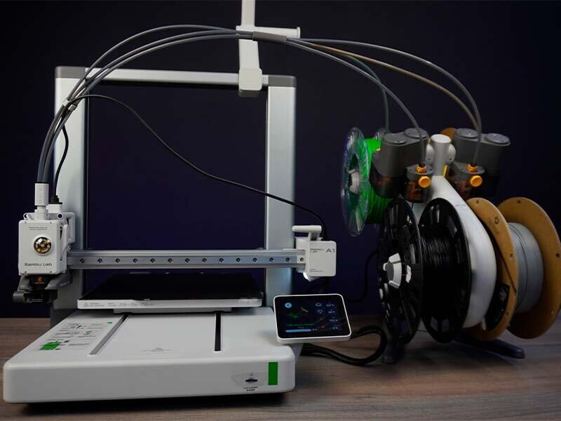

# 🧊 3D-Моделирование: от кода к реальности

> Программируешь виртуальные миры? Теперь можешь создавать реальные!

## Что тебе понадобится:
- **3D-принтер** (или доступ к нему)
- **Программа для моделирования** 
- **Слайсер** — "компилятор" для 3D-печати
- **Знания базового пайплайна**

-------------------

## coming soon...