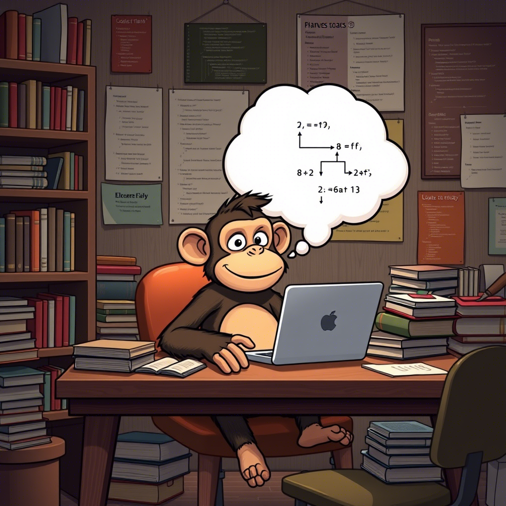

# 
Алгоритмы

<link rel="stylesheet" href="https://cdnjs.cloudflare.com/ajax/libs/animate.css/4.1.1/animate.min.css">

Исследуйте мир алгоритмов: от базовых концепций до сложных задач. Здесь вы найдете примеры, визуализации и материалы для изучения.

Алгоритмы - это всего лишь алгоритмы (с)

---

## Список алгоритмов
#### - [Алгоритм 1: "404"](algorithm1.md)
