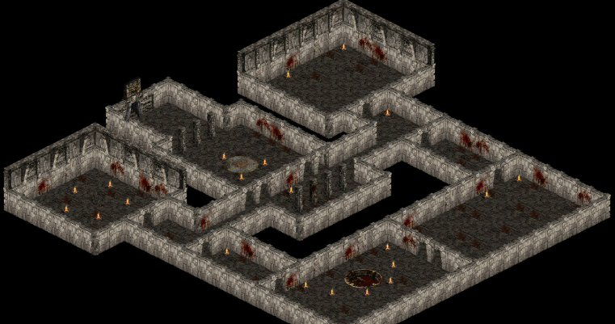

# Алгоритм правой стены (или метод правой руки) 



Это простой и интуитивный способ навигации по лабиринтам и сложным пространствам. Он основывается на том, что, следуя одной стороне лабиринта, например, правой стене, можно найти выход, если он существует. Этот алгоритм часто используется в видеоиграх, робототехнике и других областях, связанных с навигацией.

### Суть алгоритма

Алгоритм заключается в следующем: путешествуя по лабиринту или пространству, вы всегда поддерживаете контакт с правой стеной и следуете вдоль неё. Независимо от того, какой поворот или ответвление происходит, вы продолжаете держаться за стену — это поможет вам избежать тупиков и вернуться на правильный путь.

### Основные шаги алгоритма

1. Выбор начальной позиции: Начните у входа в лабиринт. Обозначьте свою правую сторону (или левую, если используете метод левой стены).

2. Движение: 
   - Если перед вами есть путь, по которому можно идти, идите по нему.
   - Если движение вперёд невозможно, поворачивайтесь вправо (чтобы продолжать держаться рядом с правой стеной) и идите в этом направлении.
   - Если справа нет стены, поворачивайте туда, где появится возможность продолжить движение.

3. Продолжение следования за стеной: Продолжайте следовать за стеной, пока не достигнете выхода из лабиринта или не столкнётесь с тупиком.

4. Проверка завершения: Если вы вернулись к уже пройденному пути, это может указывать на то, что вы в зацикленном пути, и, возможно, больше нет выхода.

### Особенности и ограничения

- Гарантия нахождения выхода: Метод правой стены будет работать в большинстве обыкновенных лабиринтов, если они являются связными, то есть все части лабиринта соединены. Если лабиринт является замкнутым (все стены образуют контур), метод может не сработать.

- Долгое время поиска: Хотя этот алгоритм гарантирует нахождение выхода, он не всегда будет находить наиболее короткий путь. Он может привести к затяжному поиску для простых лабиринтов.

- Застревание в циклах: В некоторых случаях алгоритм может застрять в цикле, если лабиринт имеет сложную структуру.

### Пример работы алгоритма

Представьте себе лабиринт, где вы входите через дверь, которая находится в центре одной из стен, а все другие стены окружают пространство. 

1. Начинаете перед входом, ваша правая рука касается стены.
2. Если есть свободный путь вперед, вы идёте вперед.
3. Если вы достигли тупика, вы поворачиваете направо к следующей стене и снова идёте.
4. Продолжаете следовать по стене, пока не встретите выход.

### Алгоритм в программировании

В программировании алгоритм правой стены может быть реализован с использованием разных структур данных, таких как графы, или в качестве логики для роботов, использующих сенсоры для определения положения стен.

Упрощенный псевдокод:

```python
while not at_exit:
    if front_is_clear:
        move_forward
    else if right_is_clear: # Поворачиваем вправо, если там есть проход
        turn_right
        move_forward
    else:
        turn_left # Поворачиваем налево, чтобы проверить другие направления
```

---

Не упрощенный код: 
```python
class Hero:
    def __init__(self):
        self.position = (0, 0)  # Начальная позиция (x, y)
        self.direction = 'N'  # Начальное направление (N, E, S, W)

    def move_forward(self):
        # Логика перемещения героя вперёд
        if self.direction == 'N':
            self.position = (self.position[0], self.position[1] + 1)
        elif self.direction == 'E':
            self.position = (self.position[0] + 1, self.position[1])
        elif self.direction == 'S':
            self.position = (self.position[0], self.position[1] - 1)
        elif self.direction == 'W':
            self.position = (self.position[0] - 1, self.position[1])
        print(f'Герой переместился на {self.position}')

    def turn_right(self):
        # Поворот направо
        directions = ['N', 'E', 'S', 'W']
        self.direction = directions[(directions.index(self.direction) + 1) % 4]
        print(f'Герой повернулся направо. Теперь он смотрит на {self.direction}')

    def turn_left(self):
        # Поворот налево
        directions = ['N', 'E', 'S', 'W']
        self.direction = directions[(directions.index(self.direction) - 1) % 4]
        print(f'Герой повернулся налево. Теперь он смотрит на {self.direction}')

    def front_is_clear(self):
        # Логика проверки на наличие стены впереди
        # Здесь должна быть реализация проверки
        pass

    def right_is_clear(self):
        # Логика проверки на наличие стены справа
        self.turn_right()
        clear = self.front_is_clear()
        self.turn_left()  # Возвращаемся в исходное направление
        return clear

    def left_is_clear(self):
        # Логика проверки на наличие стены слева
        self.turn_left()
        clear = self.front_is_clear()
        self.turn_right()  # Возвращаемся в исходное направление
        return clear

def follow_right_wall(hero):
    while not at_exit(hero):  # Предполагаем, что есть функция проверки выхода
        if hero.front_is_clear():
            hero.move_forward()
        elif hero.right_is_clear():
            hero.turn_right()
            hero.move_forward()
        else:
            hero.turn_left()

# Функция проверки выхода (нужно реализовать)
def at_exit(hero):
    # Логика проверки, достиг ли герой выхода
    pass

# Пример использования
hero = Hero()
follow_right_wall(hero)
```

Алгоритм правой стены является простым и наглядным методом навигации, который полезен в задачах поиска выхода из лабиринта. Он легко воспринимается, прост в реализации и может быть полезен в ряде приложений, особенно в играх и робототехнике. Если вам нужна дополнительная информация или примеры реализации, дайте знать!