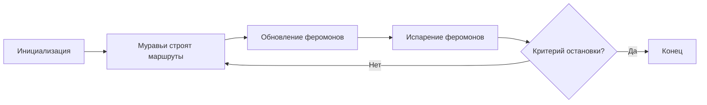

# Метаэвристические алгоритмы

Муравьиный алгоритм (Ant Colony Optimization, ACO)
Введение
Муравьиный алгоритм (Ant Colony Optimization, ACO) — это метаэвристический алгоритм, вдохновленный поведением муравьев, которые ищут кратчайший путь от колонии до источника пищи. Этот алгоритм широко применяется для решения задач комбинаторной оптимизации, таких как задача коммивояжера (TSP), маршрутизация в сетях и другие.

Основная идея
Муравьи оставляют за собой след феромонов, который помогает другим муравьям находить путь к пище. Чем короче путь, тем больше феромонов накапливается, что делает его более привлекательным для других муравьев. Этот принцип используется в алгоритме для поиска оптимальных решений.

## Принцип работы
Инициализация:

Создается граф, представляющий задачу (например, граф городов в задаче коммивояжера).
На каждом ребре графа инициализируется начальное количество феромонов.

## Построение маршрутов:

Каждый муравей строит маршрут, выбирая следующий узел на основе вероятности, которая зависит от:
Концентрации феромонов на ребре.
Эвристической информации (например, расстояния между узлами).

## Обновление феромонов:

После завершения маршрута муравьи оставляют феромоны на пройденных ребрах.

Количество феромонов зависит от качества решения (например, длины маршрута).

## Испарение феромонов:

Феромоны испаряются со временем, чтобы избежать застревания в локальных оптимумах.

Критерий остановки:

Алгоритм завершает работу, когда достигается максимальное число итераций или находится достаточно хорошее решение.

## Схема алгоритма

