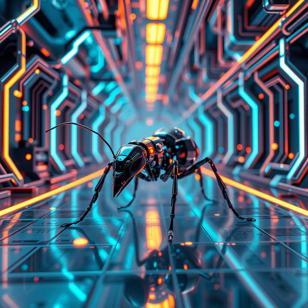

# Муравьиный алгоритм



Этот алгоритм используется для решения различных оптимизационных задач, таких как задачи коммивояжера, задачи маршрутизации и другие.

### Основные идеи муравьиного алгоритма:

1. Имитация поведения муравьёв: Муравьи в реальной жизни ищут кратчайшие пути к источнику пищи, оставляя феромоны на своем пути. Другие муравьи, проходя мимо, могут последовать за этими феромонами, что способствует обнаружению оптимальных путей.

2. Феромоны: В муравьиных алгоритмах используется концепция феромонов, которые накладываются на "пути" в матрице решения. Со временем феромоны могут испаряться, что позволяет более коротким и лучшим путям становиться более привлекательными для будущих муравьёв.

3. Эвристические функции: В дополнение к феромонам, может использоваться эвристическая информация, которая помогает выбрать направление, в котором следует двигаться "муравьям", обеспечивая большее внимание к потенциально лучшим решениям.

4. Итеративный процесс: Алгоритм итеративно генерирует решения, используя муравейский механизм. На каждой итерации "муравьи" (или агенты) исследуют пространство решения, оставляя феромоны и размножая информацию о качественных путях.

### Применения муравьиного алгоритма:

- Поиск кратчайшего пути: Решение задачи коммивояжера и других задач маршрутизации.
- Оптимизация расписаний: Использование для создания эффективных расписаний и планов.
- Оптимизация сетей: Применение в сетевой маршрутизации и распределении ресурсов.

### Преимущества и недостатки:

Преимущества:
- Способность находить хорошее приближение к оптимальному решению.
- Хорошая масштабируемость к большим и сложным задачам.

Недостатки:
- Иногда может застревать в локальных минимумах.
- Настройки параметров (например, скорость испарения феромонов) могут быть чувствительными и требуют тонкой настройки.

Муравьиный алгоритм является одним из примеров алгоритмов, основанных на природе, которые используются в вычислительной оптимизации и в различных областях науки и техники.

## Код:
```python
import random
import numpy as np

class AntColony:
    def __init__(self, distances, num_ants, num_iterations, alpha, beta, evaporation_rate):
        self.distances = distances  # Матрица расстояний между городами
        self.num_ants = num_ants  # Количество муравьёв
        self.num_iterations = num_iterations  # Количество итераций
        self.alpha = alpha  # Влияние феромонов
        self.beta = beta  # Влияние расстояний
        self.evaporation_rate = evaporation_rate  # Скорость испарения феромонов
        self.feromones = np.ones_like(distances)  # Изначально феромоны равны 1

    def run(self):
        best_path = None
        best_length = float('inf')

        for _ in range(self.num_iterations):
            paths = self.generate_paths()
            self.update_pheromones(paths)

            for path in paths:
                length = self.path_length(path)
                if length < best_length:
                    best_length = length
                    best_path = path

        return best_path, best_length

    def generate_paths(self):
        paths = []
        for _ in range(self.num_ants):
            path = self.construct_path()
            paths.append(path)
        return paths

    def construct_path(self):
        num_cities = len(self.distances)
        path = [random.randint(0, num_cities - 1)]
        visited = set(path)

        while len(visited) < num_cities:
            next_city = self.select_next_city(path[-1], visited)
            path.append(next_city)
            visited.add(next_city)

        return path

    def select_next_city(self, current_city, visited):
        probabilities = []
        for city in range(len(self.distances)):
            if city not in visited:
                pheromone = self.feromones[current_city][city] ** self.alpha
                visibility = (1.0 / self.distances[current_city][city]) ** self.beta
                probabilities.append(pheromone * visibility)
            else:
                probabilities.append(0)

        total = sum(probabilities)
        probabilities = [p / total for p in probabilities]  # Нормализация вероятностей
        return np.random.choice(range(len(probabilities)), p=probabilities)

    def update_pheromones(self, paths):
        self.feromones *= (1 - self.evaporation_rate)  # Испарение феромонов

        for path in paths:
            length = self.path_length(path)
            for i in range(len(path) - 1):
                self.feromones[path[i]][path[i + 1]] += 1.0 / length  # Увеличение феромонов

    def path_length(self, path):
        return sum(self.distances[path[i]][path[i + 1]] for i in range(len(path) - 1)) + self.distances[path[-1]][path[0]]

# Пример использования
if __name__ == "__main__":
    # Расстояния между городами (матрица)
    distances = np.array([
        [0, 2, 9, 10],
        [1, 0, 6, 4],
        [15, 7, 0, 8],
        [6, 3, 12, 0]
    ])

    # Параметры алгоритма
    num_ants = 10
    num_iterations = 100
    alpha = 1.0  # Влияние феромонов
    beta = 2.0  # Влияние расстояний
    evaporation_rate = 0.5  # Испарение феромонов

    # Создание экземпляра алгоритма и запуск
    aco = AntColony(distances, num_ants, num_iterations, alpha, beta, evaporation_rate)
    best_path, best_length = aco.run()

    print("Лучший путь:", best_path)
    print("Длина лучшего пути:", best_length)

```

1. Класс AntColony: Это основной класс, представляющий муравьиный алгоритм. Он инициализирует параметры, такие как матрица расстояний, количество муравьёв, итераций, коэффициенты α и β и скорость испарения феромонов.

2. Метод run: Основной метод, который запускает алгоритм, генерирует пути и обновляет феромоны на каждом шаге.

3. Метод generate_paths: Создаёт пути для каждого муравья, вызывая метод construct_path.

4. Метод construct_path: Строит путь муравья, случайным образом выбирая следующий город, основываясь на вероятностях.

5. Метод select_next_city: Расчитывает вероятности выбора следующего города с учетом расстояний и феромонов.

6. Метод update_pheromones: Обновляет матрицу феромонов, испаряясь и добавляя феромоны в зависимости от длины пути.

7. Метод path_length: Рассчитывает длину пути, включая возврат в начало.

## Запуск программы
Скопируйте этот код в файл с расширением .py и запустите его. Программа выведет лучший найденный путь и его длину. Вы можете настроить матрицу расстояний и параметры алгоритма для экспериментов.