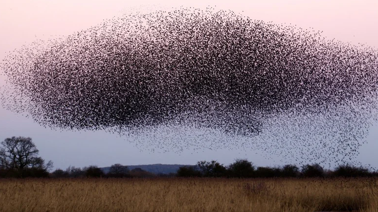

# Алгоритм Роя Частиц (Particle Swarm Optimization, PSO)



Алгоритм роя частиц (Particle Swarm Optimization, PSO) — это метаэвристический метод оптимизации, который черпает вдохновение из коллективного поведения животных, таких как птицы или рыбы, когда они движутся в группах.

## Основные идеи алгоритма роя частиц:

1. **Имитация поведения роя**: Частицы в рое представляют собой потенциальные решения задачи. Они перемещаются в пространстве решений, изменяя свои позиции на основе собственного опыта и опыта соседей, что позволяет находить оптимальные решения.

2. **Личный и глобальный опыт**: Каждая частица имеет свою собственную "память" о лучшем найденном решении (личный опыт) и доступ к лучшему решению, найденному всем роем (глобальный опыт). Эти знания используются для направления движения частиц.

3. **Скорость и направление**: Скорость и направление движения частиц определяются комбинацией их личного опыта, глобального опыта и случайного компонента, что позволяет избегать застревания в локальных минимумах.

4. **Итеративный процесс**: Алгоритм итеративно обновляет позиции и скорости частиц. На каждой итерации частицы перемещаются к новым позициям, стремясь улучшить свои решения и приблизиться к глобальному оптимуму.

## Применения алгоритма роя частиц:

- **Поиск кратчайшего пути**: Решение задачи коммивояжера и других задач маршрутизации.
- **Оптимизация расписаний**: Использование для создания эффективных расписаний и планов.
- **Оптимизация сетей**: Применение в сетевой маршрутизации и распределении ресурсов.
- **Машинное обучение**: Оптимизация гиперпараметров моделей.

## Преимущества и недостатки:

**Преимущества:**
- Способность находить хорошее приближение к оптимальному решению.
- Простота реализации и настройки.
- Хорошая масштабируемость к большим и сложным задачам.

**Недостатки:**
- Может застревать в локальных минимумах, особенно в сложных многомерных пространствах.
- Настройки параметров (например, коэффициенты ускорения) могут быть чувствительными и требуют тонкой настройки.

## Код:
```python
import numpy as np

def pso_optimization(objective_function, bounds, num_particles=30, num_iterations=100, w=0.5, c1=1.5, c2=1.5):
    dim = len(bounds)
    particles = np.random.rand(num_particles, dim)
    velocities = np.random.rand(num_particles, dim)

    for i in range(dim):
        particles[:, i] = bounds[i][0] + particles[:, i] * (bounds[i][1] - bounds[i][0])
        velocities[:, i] = (velocities[:, i] - 0.5) * 2  # Initialize velocities in range [-1, 1]

    personal_best_positions = particles.copy()
    personal_best_scores = np.apply_along_axis(objective_function, 1, personal_best_positions)
    global_best_position = personal_best_positions[np.argmin(personal_best_scores)]
    global_best_score = np.min(personal_best_scores)

    for iteration in range(num_iterations):
        for i in range(num_particles):
            r1, r2 = np.random.rand(dim), np.random.rand(dim)
            velocities[i] = w * velocities[i] + c1 * r1 * (personal_best_positions[i] - particles[i]) + c2 * r2 * (global_best_position - particles[i])
            particles[i] += velocities[i]

            # Clip positions to be within bounds
            particles[i] = np.clip(particles[i], [b[0] for b in bounds], [b[1] for b in bounds])

            # Evaluate the new position
            score = objective_function(particles[i])
            if score < personal_best_scores[i]:
                personal_best_scores[i] = score
                personal_best_positions[i] = particles[i]

            if score < global_best_score:
                global_best_score = score
                global_best_position = particles[i]

    return global_best_position, global_best_score

# Пример использования
def objective_function(x):
    return np.sum(x**2)

bounds = [(-5, 5), (-5, 5)]
best_position, best_score = pso_optimization(objective_function, bounds)
print("Лучшее решение:", best_position)
print("Значение функции:", best_score)
```

## Объяснение кода:

* Инициализация: Создается начальная популяция частиц и их скоростей. Позиции частиц случайным образом распределяются в заданных границах.
* Оценка: Каждая частица оценивается с помощью целевой функции.
* Личный и глобальный опыт: Каждая частица запоминает свое лучшее положение (личный опыт), а также имеет доступ к лучшему положению всего роя (глобальный опыт).
* Обновление скорости и позиции: Скорость и позиция каждой частицы обновляются на основе личного и глобального опыта, а также случайных компонентов.
* Итерация: Процесс повторяется заданное количество раз, чтобы найти оптимальное решение.
* Этот код можно адаптировать для различных задач оптимизации, изменяя целевую функцию и параметры.