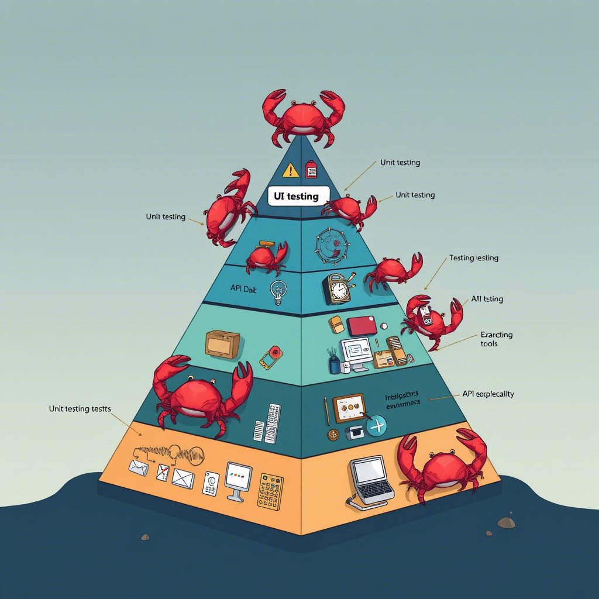
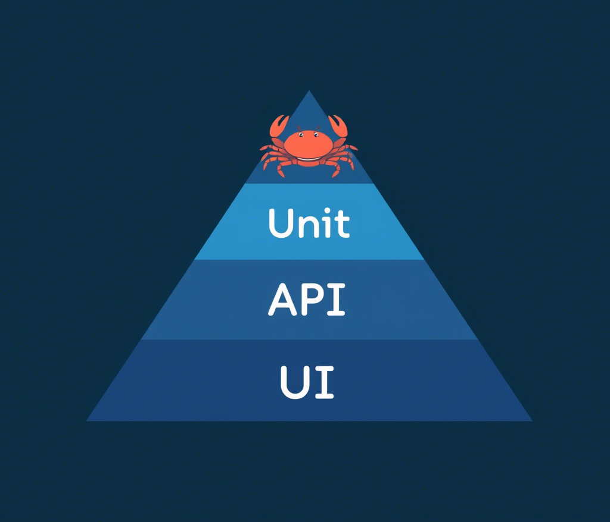
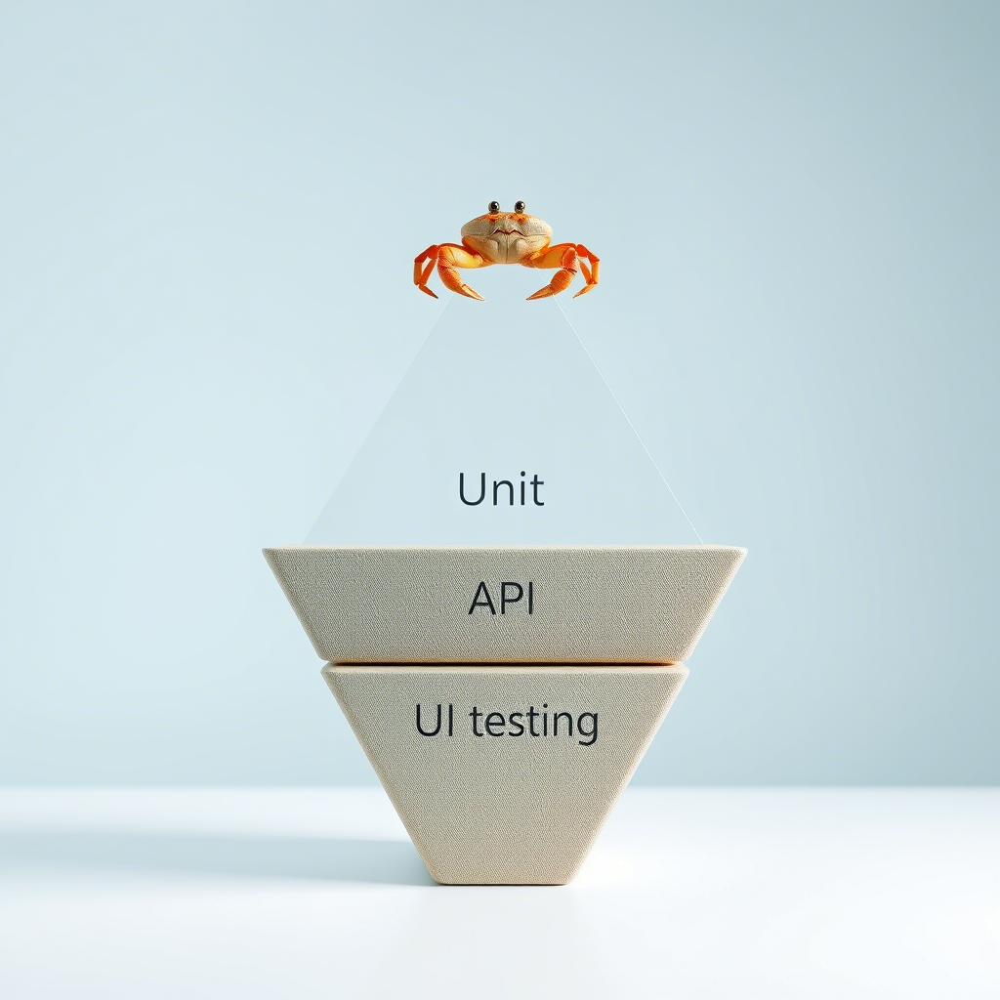
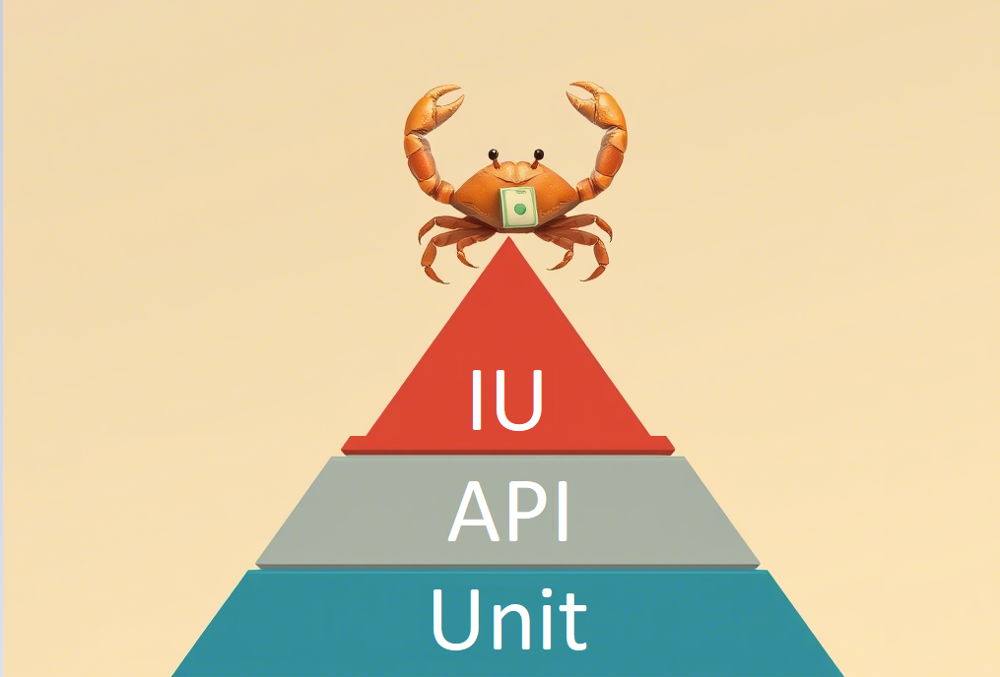

Загляни-ка на дно моря, где живет наш давний друг — краб. Да-да, тот самый, который с гордым видом ползает в своем панцире и считает, что его пузырьки — это вершина эволюции. А теперь представь, что ты — этот самый краб, который, несмотря на непримечательный вид, оказался в мире тестирования.

## Что это за пирамида и зачем она нужна?

Пирамида тестирования — это модель организации тестирования программного обеспечения, которая иллюстрирует распределение различных типов тестов на нескольких уровнях. Стандартная пирамида тестирования состоит из трех основных уровней:

1. Unit-тесты (нижний уровень) — тестируешь отдельные функции, методы, классы. Всё, что можно изолировать. Это основа, фундамент. Если у тебя тут дыры, то всё остальное — просто показуха.
2.	API-тесты (середина) — проверяешь, как работает API. Это твои endpoints, запросы, ответы, статус-коды и всё, что между ними. Это не просто "интеграционные тесты", это отдельный слой, который проверяет, что твоё приложение правильно общается с внешним миром.
3.	UI-тесты (верхушка) — это уже тесты, которые имитируют действия пользователя. Самые медленные, самые хрупкие, самые дорогие в поддержке.

## Крабы в ведре: кто кого тянет вниз?
Команда разработки — это стая крабов, которые пытаются выбраться из ведра. Каждый краб — это либо разработчик, либо тестировщик. 
И вот что происходит:

Разработчики-крабы. Они сидят на дне ведра и думают: 

"Зачем нам unit-тесты? Мы и так знаем, что наш код работает!" 

Они не хотят карабкаться вверх, потому что это требует усилий. Вместо этого они продолжают копать глубже, добавляя новые фичи без тестов. А когда что-то ломается, они кричат:

"Эй, тестировщики, что там сломалось?"

Тестировщики-крабы. Они пытаются выбраться из ведра, но их постоянно тянут вниз разрабы, потому что не пишут unit-тесты, они начинают писать тонны UI- и API-тестов, чтобы хоть как-то удержать качество. Но чем больше они пишут, тем тяжелее становится ведро. В итоге они тоже начинают тонуть, потому что поддерживать все эти тесты — это адский труд.

Ведро — это пирамида тестирования. Если все крабы работают вместе, они могут выбраться из ведра и построить красивую, устойчивую пирамиду. Но если каждый тянет в свою сторону, ведро переворачивается, и все оказываются на дне.

## А в чём корень проблемы?

Почему пирамида тестирования превращается в перевёрнутую свалку тестов:

* "У нас нет времени". Классика. Разработчики завалены задачами, дедлайны горят, и unit-тесты оказываются в самом низу списка приоритетов. В итоге они пишут код, который "просто работает", и бегут дальше.
* "Это не моя работа". Некоторые разработчики искренне считают, что тестирование — это задача тестировщиков. Они пишут код, а кто-то другой должен его проверять. Это, конечно, бред, но такая позиция встречается чаще, чем кажется.
* "У нас и так всё работает". Разработчики настолько уверены в своём коде, что считают unit-тесты излишними. Пока всё работает, зачем тратить время на тесты? Но, как мы знаем, "работает" — это временное состояние.
  

А что автотестировщики? Они видят, что unit-тестов нет, и начинают компенсировать это своими силами. Но как они это делают? Правильно, пишут больше UI- и API-тестов. И вот тут начинается проблема.

1.	Если unit-тестов нет, то автотестировщики начинают писать тонны UI-тестов, чтобы хоть как-то покрыть функциональность. Это приводит к тому, что пирамида переворачивается: UI-тестов становится слишком много, они медленные, хрупкие и дорогие в поддержке.
2.	API-тесты как замена unit-тестов. Автотестировщики также начинают писать больше API-тестов, чтобы компенсировать отсутствие unit-тестов. Но API-тесты — это не замена unit-тестам. Они проверяют другой уровень, и их не должно быть слишком много.
3.	Автотестировщики не могут всё исправить. Даже если автотестировщики пишут тонны тестов, они не могут полностью компенсировать отсутствие unit-тестов. Unit-тесты — это основа, и без них вся система тестирования становится неустойчивой.

## Как крабам выбраться из ведра?
1.	Начни с unit-тестов. Если ты не можешь написать unit-тест, то у тебя проблемы с архитектурой. Unit-тесты должны покрывать большую часть твоего кода. Они должны быть быстрыми и изолированными. Если у тебя их нет, то ты просто тратишь время на поддержку хрупких UI-тестов.
2.	Добавь API-тесты, но не переусердствуй. Их не должно быть слишком много. Они должны проверять ключевые endpoints и сценарии. Если ты пишешь API-тест на каждую мелочь, то ты делаешь что-то не так.
3.	UI-тесты — это последний рубеж. UI-тесты должны быть минимальными. Они должны проверять только самые важные сценарии, которые нельзя покрыть unit- и API-тестами.
4.	Разработчики должны писать unit-тесты. Это часть процесса разработки, а не что-то дополнительное. Если разработчики не пишут unit-тесты, то это проблема, которую нужно решать на уровне процессов и культуры.
5.	Автотестировщики не должны компенсировать чужие ошибки. Если разработчики не пишут unit-тесты, это не значит, что автотестировщики должны писать больше UI- и API-тестов. Лучше потратить время на то, чтобы научить разработчиков писать unit-тесты.
6.	Культура качества — это общая ответственность. Тестирование — это не только задача тестировщиков. Это общая ответственность всей команды. Разработчики, тестировщики, менеджеры — все должны понимать важность unit-тестов и работать вместе, чтобы пирамида тестирования была построена правильно.

Если ты тестировщик, не бери на себя чужую работу. Лучше потрать время на то, чтобы донести до разработчиков важность unit-тестов и помочь им начать их писать. Иначе ты будешь вечно бороться с последствиями, вместо того чтобы устранить причину.
Это руководство к действию. Перестань делать это неправильно. Начни с основ. Построй пирамиду так, как она должна быть построена. Если ты краб в панцире, то вылезай из него и начни делать всё правильно. Иначе ты так и останешься на дне ведра, в компании других крабов, которые тоже не понимают, что делают.
