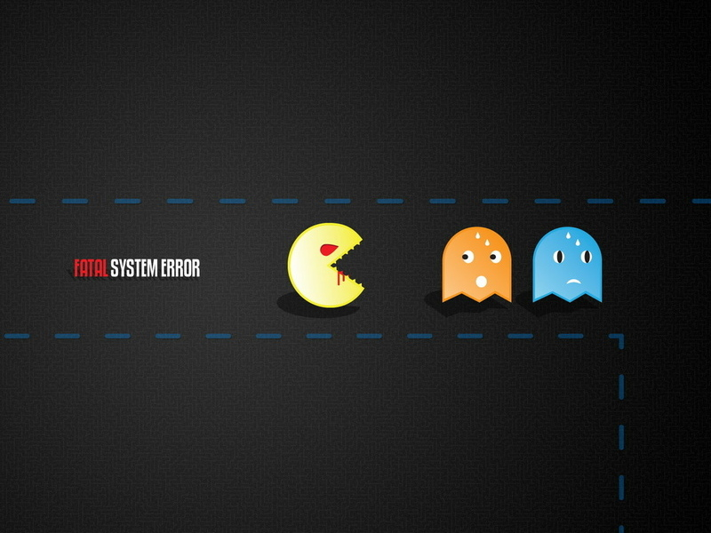

# Статья 4: Конфликт как катализатор качества: Почему разработчики и тестировщики — не друзья

В мире разработки программного обеспечения существует вечный конфликт между двумя ключевыми фигурами: разработчиками и тестировщиками. Этот конфликт, хотя и может показаться деструктивным, на самом деле является движущей силой, которая рождает качество продукта.

## Разработчики: Архитекторы цифрового мира
Разработчики — это творцы, художники кода. Они создают программы из ничего, воплощая идеи в жизнь. Их цель — построить функциональный и инновационный продукт, который удовлетворит потребности пользователей. Однако, в стремлении к быстрому релизу, они могут упустить из виду мелкие детали, которые впоследствии станут причиной ошибок.

## Тестировщики: Стражи качества
Тестировщики, напротив, — это скептики, которые ставят под сомнение каждую строчку кода. Их миссия — найти и уничтожить любые баги, прежде чем продукт попадет к конечному пользователю. Они не боятся задавать неудобные вопросы и требовать исправлений, даже если это вызывает раздражение у разработчиков.

## Конфликт как источник совершенства
Конфликт между разработчиками и тестировщиками неизбежен, но именно он рождает качество. Разработчики стремятся к инновациям, тогда как тестировщики требуют стабильности. Это противостояние заставляет обе стороны работать лучше, искать компромиссы и совершенствовать продукт.

## Разработчики учатся на ошибках: Каждый найденный баг — это урок, который делает код крепче.
Тестировщики становятся более изобретательными: Они находят новые способы "сломать" продукт, что в конечном итоге делает его более надежным.
Заключение
Конфликт между разработчиками и тестировщиками — это не просто столкновение интересов, а необходимый элемент процесса создания качественного программного обеспечения. Именно в этом противостоянии рождается продукт, который удовлетворяет потребности пользователей и выдерживает испытание временем. Так что, пусть они и не друзья, но их конфликт — залог успеха.