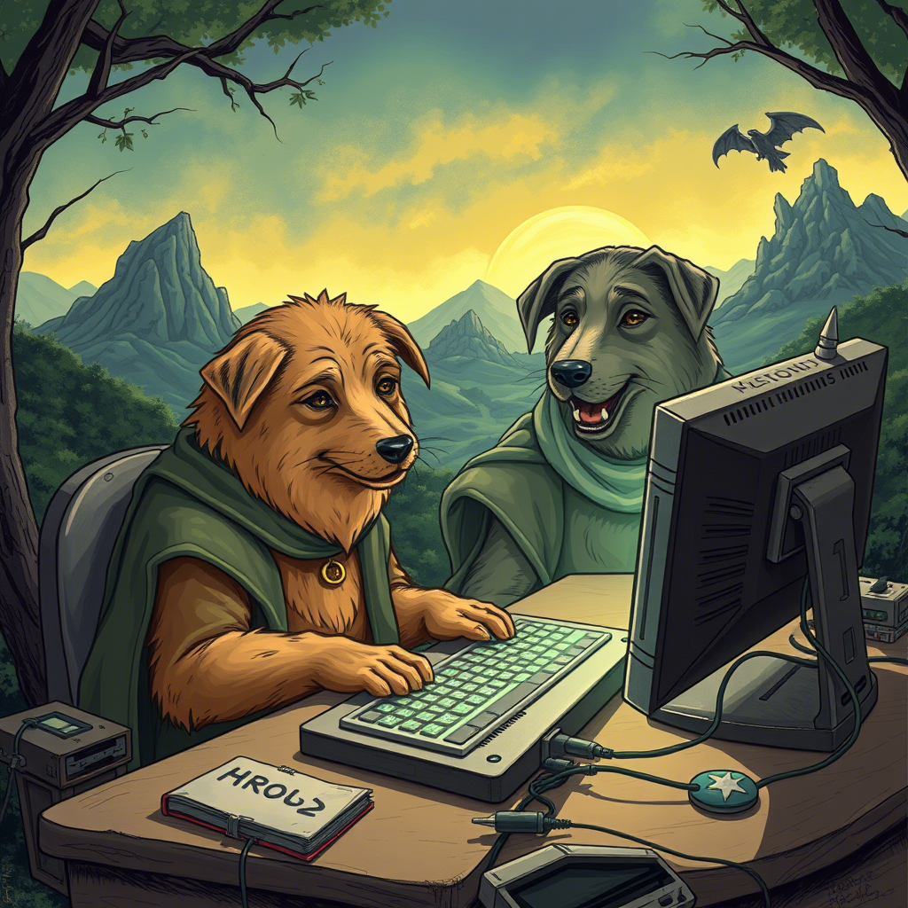

# Продо и Кольцо Багов

В далёкой-далёкой стране, где код был законом, а баги — проклятием, жил-был автотестировщик по имени Продо. Он был невысокого роста, носил очки с толстыми линзами и постоянно бормотал что-то про "некорректные тест-кейсы". Его верный друг, тестировщик Сет, всегда был рядом, чтобы помочь в трудную минуту. Он был дотошным и всегда писал большие отчёты, в которых подробно описывал каждую найденную ошибку.  
Однажды, в тихом уголке офиса, Продо нашёл флешку. Она лежала под стопкой документации, которую никто никогда не читал. Флешка была странная: она мигала, как не сохранённый файл, и издавало звуки, похожие на ошибки компиляции. Продо сразу понял, что это не просто флешка, а что-то зловещее. Он попытался выбросить ее в мусорку, но флешка вернулась, как неправильно настроенный редирект.

Их путешествие началось в серверной комнате, где они встретили мудрого девопса Стендальфа. Он был одет в плащ из старых кабелей и держал в руке клавиатуру. Стендальф посмотрел на эту флешку и сказал:

"Это Кольцо Багов. Оно может уничтожить весь мир IT, если от него не избавиться. Но будьте осторожны — оно соблазняет даже самых стойких. Один мой знакомый разработчик взял его и теперь пишет только на PHP. Кольцо Багов соблазняет всех, кто к нему прикасается. Оно обещает вам власть над всеми системами, бесконечные дедлайны и возможность писать код без единого теста. Но цена... цена ужасна…"

## Гитгоблины и их мерзкие привычки

Первым испытанием стала встреча с Гитгоблинами — маленькими, мерзкими существами, которые постоянно создавали конфликты в репозиториях. Они шипели: "Мердж-мердж-мердж!" и бросались в Продо и Сeта ветками, которые даже не компилировались. Продо, вооружённый знаниями о ветвлении и слиянии, сразу понял, что это будет непросто. 

"Сет, будь готов! — крикнул он. — Эти твари знают, как создать конфликт даже в пустом репозитории!"

Сет, как всегда, был спокоен. Он взял свою кружку кофе, сделал глоток и сказал: 

"Не переживай, я просто удалю всё и раскачу заново. Так быстрее." 

Гитгоблины, видя, что их атаки не приносят результата, начали отступать. Но перед тем, как исчезнуть в тени не отслеживаемых файлов, их лидер, самый мерзкий из всех, крикнул:

"Вы ещё вернётесь! Мы всегда найдём способ создать конфликт! И в следующий раз у нас будет ещё больше веток! И ещё больше непонятных коммитов!"

Продо вздохнул и посмотрел на Сета. 

"Ты понимаешь, что они правы? Конфликты — это вечная проблема."

"Ну и что? — улыбнулся Сет. — Главное — не принимать их близко к сердцу. И всегда держать под рукой git reset --hard."

## Лес Ошибок: стэк-трейсы
Затем они попали в Лес Ошибок. Это было жуткое место, где деревья были покрыты странными символами и кодами. Каждое дерево кричало: "NullPointerException!" и "Segmentation fault!". Ветви деревьев были похожи на бесконечные стэк-трейсы, которые уходили куда-то в небо.
Продо и Сет шли осторожно, стараясь не наступить на корни, которые выглядели как неправильно написанные регулярные выражения.

"Смотри, — прошептал Продо, указывая на дерево, — это же стековое переполнение! Оно такое большое, что даже рекурсия позавидовала бы."

Вдруг из-за куста, который был похож на гигантский блок непрочитанных писем в почте, появился эльф Гитлас.

"Кто идёт в мой лес? — спросил Гитлас, натягивая тетиву. — Вы здесь, чтобы исправить баги или чтобы создать новые? И, главное, вы точно не из тех, кто пушит прямо в main?"

Продо и Сет переглянулись. 

"Мы здесь, чтобы уничтожить Кольцо Багов”, — ответил Продо, стараясь не смотреть на стрелу, которая явно была помечена как // TODO: исправить это позже.

Гитлас помог им найти скрытые баги, и предупредил: 

"Будьте осторожны, здесь водятся рекурсивные белки”

## Болото Зависаний: где время теряет смысл
Продолжая путь, они оказались в Болоте Зависаний. Это было место, где время текло как-то странно: минуты растягивались в часы, а часы — в вечность. Болото было заполнено процессами, которые "почти завершились", и запросами, которые "вот-вот ответят". 
Каждый шаг требовал невероятного терпения и навыков оптимизации. Продо и Сет пробирались через трясину, стараясь не наступить на "вечно грузящиеся спиннеры" Время от времени из болота выскакивали уведомления:

"Подождите немного...", "Идёт загрузка...", "Примерно 1 минута осталось..." — но минуты проходили, а ничего не менялось. 

## Сауронов-Багмейкер 

Наконец, они добрались до Вулкана Удаления. Но у входа их поджидал главный враг — Сергей Сауронов. Он был огромным, с горящим глазом, который напоминал бесконечный лог-файл. Сауронов попытался убедить Продо оставить кольцо, обещая ему власть над всеми системами. 

"Представь, — шипел он, — ты сможешь деплоить в пятницу вечером, и никто не остановит тебя! Ты сможешь писать код без тестов, и он будет работать, всегда!"

"Не слушай его! — закричал Сет, — Он просто хочет, чтобы ты стал менеджером!”

Сауронов улыбнулся, его горящий глаз сверкал, как бесконечный лог-файл, он повторял:

"Ты не такой, как они— Ты автотестер, не разраб, не тестер. Они никогда не примут тебя. Ты для них всегда будешь другим. Ты думаешь, они ценят тебя? Они даже не знают, как работает твой код!"

Продо смотрел на него, глаза были полны смятения. Он медленно поднимал руку, чтобы подключить флешку к своему асер.

"Продо! Продо!”

— кричал Сет, и слёзы текли по его щекам.

— Мы прошли через столько всего. Помнишь? Лес Ошибок? Болото Зависаний? Гитгоблины, которые чуть не замержили нас в main? Мы прошли через всё это вместе. Ты не другой. Ты — мой друг. Ты — тот, кто всегда находил баги, даже когда все уже сдались. Ты — тот, кто писал тесты для тестов. Ты — тот, кто верил, что чистый код возможен. Ты — тот, кто заставил меня поверить, можно написать автотест без ручных проверок!" 

Продо слышал Сета. Его слова, как теплый рефакторинг, проникали в самое сердце.

"Сэт... — прошептал он. — Ты прав. Я не один."

И с этими словами Продо нашёл в себе силы. Он открыл свой асер и быстро набрал команду, чтобы запустить Глобальный Автотест Очистки. Это был тест, который они писали вместе много месяцев назад, но никогда не решались запустить. Он был предназначен для самых критических ситуаций — когда всё зависало, ломалось и казалось, что выхода нет.

"Запускаю автотест, — сказал Продо, его голос был твёрдым. — Если это не сработает, то... ну, хотя бы мы попробовали."

Он нажал Enter. На экране появилась надпись: "Running Global Cleanup Test... Please wait..."

Сет замер. "Продо, ты уверен? Этот тест... он же может удалить всё!"

"Иногда нужно рискнуть, — ответил Продо. — Иначе мы никогда не избавимся от этих проклятых багов."

Автотест начал свою работу. На экране мелькали строки кода: "Deleting corrupted files...", "Clearing cache...", "Resolving conflicts..." Вулкан начал дрожать, а лава из бесконечных циклов и утечек памяти бурлила всё сильнее.

Сауронов завыл от ярости.

"Нет! — кричал он. — Вы не можете этого сделать! 
Я... я... segmentation fault!" — и с этими словами он начал рассыпаться в пыль.

Флешка с Кольцом Багов замигала, как будто пыталась сопротивляться. Но автотест был неумолим. На экране появилась последняя строка: "Deleting Ring of Bugs... Done."
Кольцо произнесло: "Exception in thread 'main' java.lang.NullPointerException!" и исчезло в огне.

## Мир IT спасён
После уничтожения Кольца Багов и падения Сергея Сауронова мир IT вздохнул с облегчением. Серверы перестали зависать, баги исчезли, а разработчики наконец-то смогли деплоить в пятницу вечером без последствий. Продо и Сет стали героями, о которых слагали легенды. Их имена упоминали на митапах, их цитировали в статьях на Хабре, а их фото висело в каждом офисе рядом с портретом Линуса Торвальдса.
Но для Продо и Сэта самое важное было не слава, а то, что они сделали это вместе. Они вернулись в свой офис, где их встретили коллеги с пиццей и кофе. Стендальф улыбнулся и сказал: 

"Вы сделали это. Мир IT спасён. Но помните: баги всегда возвращаются. И когда это случится, вы будете готовы."

