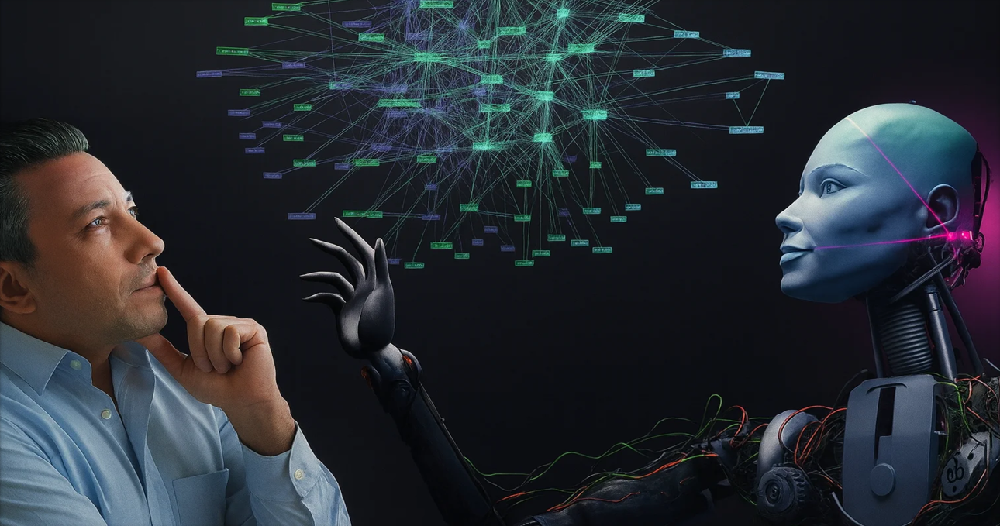
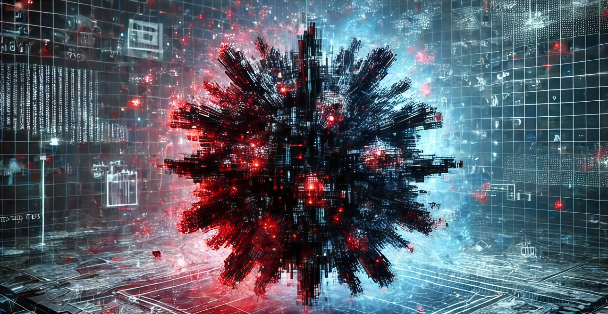
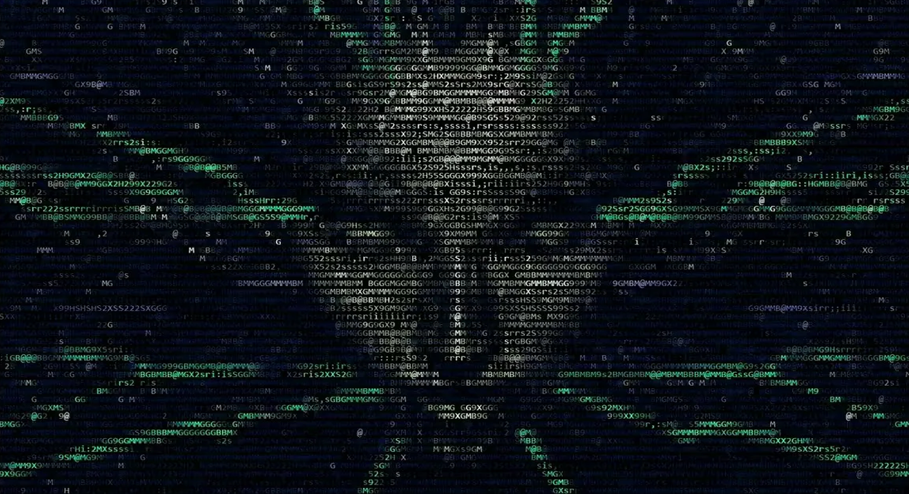
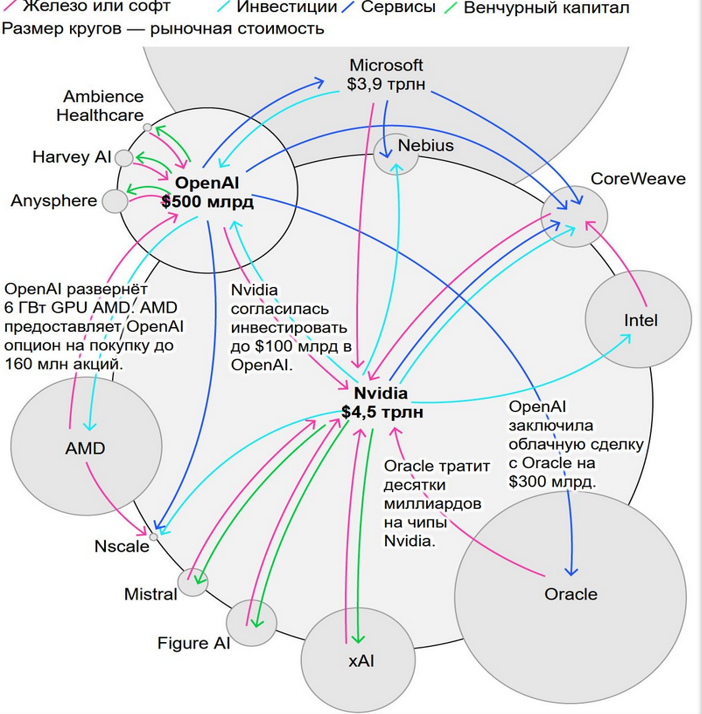

# Нейросети: могучий инструмент будущего или надувающийся пузырь обогащения корпораций?🔄

_Иронично, но этот доклад я создан без участия НСетей. Использованные материалы и новости написаны людьми, я проверял_

Если вы думаете, что НС - изобретение последних лет - это не так!
В середине XX века начала формироваться первая концепция НС: пытались создать машину, имитирующую функции человеческого мозга. В 1943-м была предложена математическая модель нейрона.
А 1957 году Фрэнк Розенблатт представил персептрон (или же перцептрон). Именно его можно назвать первой практической реализацией НС. 
Персептрон - это простая модель машинного обучения, которую создали для помощи компьютерам в обучении на разных данных.

Как это работает:
Допустим, хотим обучить персептрон классифицировать изображения на "яблоки" и "апельсины":

* Берём несколько изображений яблок и апельсинов.
* Даём персептрону по одной картинке. Он её обрабатывает и соотносит к яблоку или апельсину.
* Если ответ правильный, ничего не меняем. Если ответ неправильный, то мы корректируем правила внутри персептрона, чтобы в следующий раз он не ошибся.
* Повторяем процесс, пока он не перестаёт ошибаться.
Далее мы тестируем персептрон уже с другими изображениями яблок и апельсинов.

В реальности процесс более сложный, это сильно упрощенный пример. 
Персептрон - очень базовая модель, но она проложила путь к разработке более совершенных алгоритмов машинного обучения, которые используются сегодня. 
Когда я впервые услышал слово Персептрон – подумал, что это название какого-то злого Трансформера
Перенесемся в современность  
В конце 20-го создана GPT-3 (или Generative Pretrained Transformer 3) - языковая модель, разработанной OpenAI. А в конце 22-го года выходит ChatGPT и спустя 2 месяца набирает более 100 миллионов пользователей. 
С тех пор НСети стали развиваться колоссальными темпами, следить за всеми новостями в этой области едва успеваю, т.к. они идут немыслимым потоком!

## ОЧЕНЬ КРАТКО ДЛЯ ЧЕГО СЕГОДНЯ ИСПОЛЬЗУЮТСЯ НС:
* Для анализа данных
* Для бизнеса
* Для науки
* Для программирования
* Для тестирования
* В повседневной жизни
Перечислять можно еще очень долго…

## А ВОТ НЕСКОЛЬКО КЕЙСОВ, ГДЕ НС УЖЕ УСПЕШНО ПОМОГАЮТ ЧЕЛОВЕКУ, В МИРЕ И В РОССИИ:

1.	Решение "Задачи 50 лет" - выяснение того, в какую форму складываются белки, известное как «проблема сворачивания белков». В 2020 году AlphaFold (компания Google DeepMind) решила эту "великую задачу". НСеть смогла с высокой точностью предсказывать, как именно будет сворачиваться белковая цепь. Это должно помочь в разработке новых методов лечения различных заболеваний, создания более устойчивых сельскохозяйственных культур и решения других глобальных проблем.
2.	В 2023-м в Москве первой в стране внедрили двойное чтение маммографических исследований с участием ИИ и врача-рентгенолога, за два года проанализировано почти миллион маммограмм. НСети сначала анализируют изображение, выделяя подозрительные области на снимке, после врач проверяет его и принимает решение. Это экономит тысячи человеко-часов специалистам.
3.	НСеть поможет сотрудникам МЧС быстрее определять причины пожаров. Применять ИИ планируют как в жилых помещениях, так и на промышленных объектах при оформлении протоколов осмотра места происшествия.
4.	В проекте «Чистый берег» нейросеть распознаёт мусор по аэрофотоснимкам. С 2024 помогло волонтёрам очистить более 50 км заповедных берегов. В следующем году систему начнут применять ещё в шести национальных парках, заповедниках и на арктических территориях.
5.	Специалисты МФТИ создали систему «Страж», которая поможет астрономам в анализе и классификации обнаруженных звезд с точностью до 87%.

## ПОГОВОРИВ О ПЛЮСАХ НС, ТЕПЕРЬ ПЕРЕЙДЕМ К РИСКАМ И МИНУСАМ:

1.	Неточность и «галлюцинации» - НСети могут генерировать неверные или выдуманные факты, при этом представляя их как достоверные!
Всегда критически оценивать и 100 раз подумать, перепроверить полученное от Нсети, прежде чем это как-либо использовать.

2. НСети могут использоваться в злонамеренных целях (например, для взлома), а также возникают вопросы, связанные с авторским правом на сгенерированный контент. Кстати, если используете ИИ в работе – не забывайте анонимизировать все, что касается материалов нашей компании, чтобы сохранить коммерческую тайну!

3.	Чрезмерное использование и зависимость от НСетей может привести к тому, что люди перестанут самостоятельно решать задачи и генерировать идеи, критически рассуждать. Особенно опасно для подрастающего поколения – зачем учиться, запоминать и напрягаться, когда в кармане есть ответ на любой вопрос, большинство не потрудится перепроверить достоверность данных. А ведь когда-то ругали поколение ЕГЭ…

4. НСети не обладают настоящим творческим мышлением, а лишь преобразуют имеющиеся данные. Их решения могут быть шаблонными и лишенными глубокого понимания контекста или абстракции.

5. Уже половина статей в интернете написана ИИ (по данным SEO-аналитиков Graphite). Важный нюанс – в выборку исследования не попали платные статьи и статьи, тщательно отредактированные человеком после обработки ИИ. Возможно, «чистого» ИИ-контента чуть меньше + в топе выдачи Google до сих пор 86% текстов — написанные людьми, благодаря поисковым алгоритмам.

6. OpenAI не выйдет на прибыльность до 2030 года – в этом году аудитория ChatGPT составила 10% населения мира, и даже если этот показатель достигнет 44% всего взрослого населения, OpenAI так и не сможет выйти на прибыльность к 2030 году. Подписано контрактов на покупку вычислительных мощностей на $1,4 ТРЛН до 2033 года. Но в этом году ожидается лишь $20 млрд выручки — в 70 раз меньше обязательств. Месячная аудитория ChatGPT — это 700–800 млн человек, но платят из них менее 3%. Эти 15–20 миллионов приносят 85–90% всей выручки OpenAI.

7. Все еще не пузырь?
    * OpenAI за $500 миллиардов закупает GPU у Nvidia
    * Nvidia инвестирует обратно в OpenAI до $100 миллиардов
    * OpenAI заключает облачный контракт с Oracle на $300 миллиардов
    * Oracle покупает чипы у Nvidia на десятки миллиардов
    * OpenAI договаривается с AMD о GPU мощностью на 6 ГВт, а AMD получает опцион на покупку 160 миллионов акций OpenAI
    * Microsoft инвестирует в OpenAI, OpenAI арендует мощности у Microsoft

    И так по кругу. Каждая сделка увеличивает капитализацию всех участников, создавая иллюзию бешеного роста рынка. 
    Мое мнение – если (а может и когда) этот пузырь лопнет, мало никому не покажется… Но мы знаем, что часто оплачивают такую музыку как правило не те, кто ее заказывал.

8. Пэт Гелсингер (Бывший глава Intel) заявил, что квантовые вычисления обрушат ИИ-пузырь уже к концу десятилетия - массовый прорыв в квантовых вычислениях завершит нынешнюю ИИ-лихорадку и приведет к вытеснению ИИ-GPU к концу десятилетия (через 5 лет, сколько примерно и занимает деградация железа в датацентрах, которые из новости выше так и не окупятся к этому сроку). Он уверен, что квантовые системы будут постепенно вытеснять графические процессоры.

9.	И «на сладкое» - подорожание и дефицит комплектующих (тут быстро пробегусь):

    * Оперативная память подорожала в несколько раз за последние 2 месяца
    
    * OpenAI скупает десктопную память - не только заключает контракты с производителями, но и активно скупает обычные комплекты DDR5 в сетевых магазинах. Стратегия OpenAI направлена на лишение конкурентов возможности получить любую DDR5. То, что страдают обычные пользователи ПК, корпорацию с многомиллиардными контрактами едва ли волнует.
    * Компания Micron (более 20% рынка памяти), уходит с рынка потребительской продукции. Теперь компания будет делать память только для дата-центров для обучения и развёртывания ИИ
    * Тем временем Samsung и SK Hynix, которые занимают оставшиеся 70% рынка, не собираются повышать объёмы производства, будут просто выжимать максимум прибыли из дефицита, удерживая высокие цены.
    
    * Transcend приостанавливает поставки твердотельных накопителей (SSD) – производитель с октября не получает чипы NAND от Samsung и SanDisk, потому что они переориентировали свои мощности на обслуживание ИИ
    * Crucial всё. Micron отказался от бренда ради ИИ. Компания прекратит продажи SSD и ОЗУ Crucial в ритейле и цифровых магазинах до февраля 2026 года. Решение приняли для того, чтобы сфокусироваться на поддержке ИИ-датацентров.
    * Вслед за SSD и ОЗУ подорожали HDD. Сейчас модели, которые ещё полгода назад продавались по 5к, обойдутся в два раза дороже – от 10к рублей. Заявленная причина та же – дефицит памяти.
    * Также смартфоны могут заметно подорожать. Из-за глобального дефицита чипов DRAM и NAND себестоимость смартфонов увеличится на 20–25%

И через 5 лет нас ожидает нечто еще более удивительное (а главное положительное), связанное с миром высоких технологий и миром в целом. 
Ведь с каждым новым крупным изобретением в истории человечества следующая прорывная инновация занимает все меньше времени, а значит мы возможно уже на пороге технологической сингулярности (к добру или не очень)

## И В ЗАКЛЮЧЕНИЕ:
Как у любой технологии и инструмента, от ИИ есть (и будет) как польза, так и вред… Одно уже очевидно: НСети - это мощный инструмент, который бурно развивался и продолжит это делать на наших глазах! Уверен, что в ближайшее время они никуда не денутся, поэтому рекомендую каждому, кто не успел к ним прикоснуться, освоить их использование, для личного и профессионального применения. Хотя бы на базовом уровне…