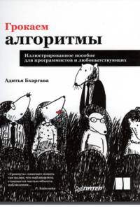
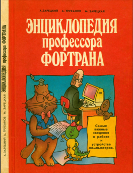
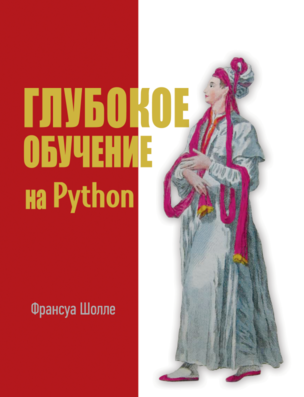
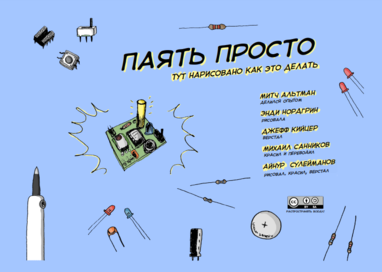

# 
Книги

<link rel="stylesheet" href="https://cdnjs.cloudflare.com/ajax/libs/animate.css/4.1.1/animate.min.css">
Здесь вы можете скачать полезные книги по программированию и другим темам.

## "Грокаем алгоритмы" Адитья Бхаргава

- [Скачать PDF](https://vk.com/doc10943591_562494560?hash=VBUdT9NFWap8VZr4etYWprk9UtXplZzMLdaw76fnj04&dl=JUYxzjk4Bz9X40bLAXLzGBks5GGwwhD7vuyStjv0ZX4&api=1&no_preview=1)

---

## «Энциклопедия профессора Фортрана» А. Зарецкий, А. Труханов, М. Зарецкая

- [Скачать PDF](https://vk.com/doc415041562_577265753?hash=cRNb7csFvaZOZFaj7HskkWzyZGdhbn74eA33OisOs8g&dl=UvdXfD7kYiyxOz3bqP93e9a8G5yINAcsYq79jrM6s8H&api=1&no_preview=1)

---

## "Глубокое обучение на Python"  Шолле Ф.

- [Скачать PDF](https://vk.com/doc10943591_564417162?hash=1m4OQ7SL57zYwqvzW3ayTlDhZoBC66bfXVW3MP0sSZg&dl=0oplKqVYZ6NhZrt55Csa4jZ3xFejqpF8lbHLrUzmqU8)

---

## Комикс «ПРОДУКТЫ 24» Виталий Терлецкий

- [Скачать PDF](https://vk.com/doc81289_529724225?hash=VowtBmmwYYjrixtkdsTt89D6PS256niOh7PrqzJB5gL&dl=uzDYmkqR8LBlPTdWA4duLWX9VcjvVm9ZBHbW0dB3Kcc&api=1&no_preview=1)

---

## Комикс «Паять просто»

- [Скачать PDF](https://vk.com/doc10943591_557426364?hash=5UhiGLSUyFzGZ63norzQ18riwRGaAXuQEKBE4RFzayo&dl=5BMSbZrzbgBgzS1CdvZeI57vkbISTg9nCKJDm2SzN2T)

