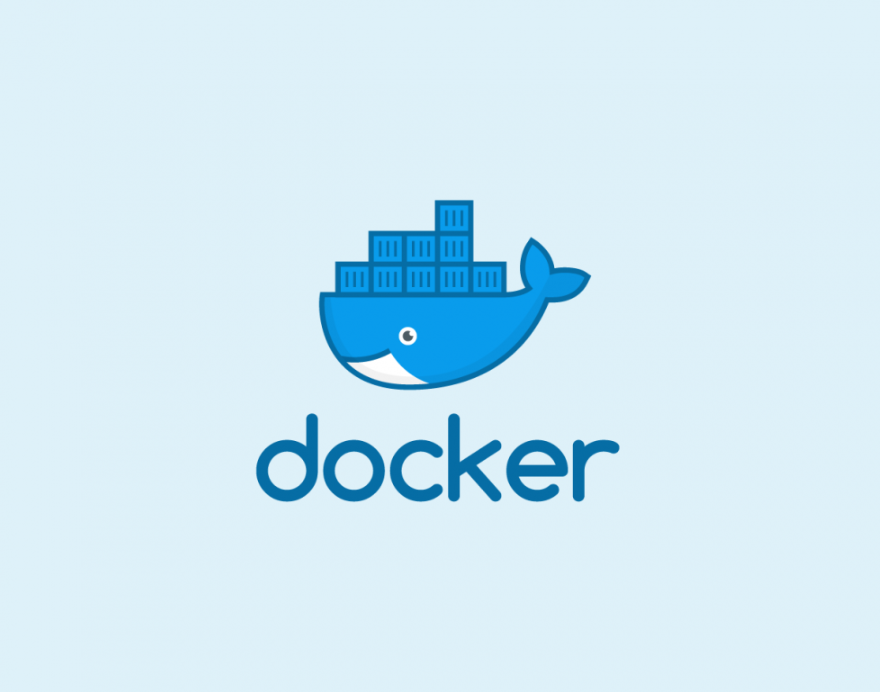

# Гайд по Docker

---
 

**Введение в Docker**

Docker — это платформа для разработки, доставки и запуска контейнеризированных приложений. Она позволяет упаковывать приложения и их зависимости в контейнеры, которые можно запускать на любой системе, поддерживающей Docker. Это обеспечивает консистентность среды, упрощает развертывание и масштабирование приложений.

Если вы хотите улучшить процесс разработки и развертывания приложений, Docker станет вашим надежным помощником.

## 1. **Основные концепции Docker**

Перед тем как начать работу с Docker, важно понять его ключевые компоненты:

- **Контейнер (Container)**: Легковесная и изолированная среда выполнения приложения, которая включает в себя все необходимые зависимости.
- **Образ (Image)**: Шаблон, из которого создаются контейнеры. Образ содержит все файлы, необходимые для запуска приложения.
- **Dockerfile**: Текстовый файл, содержащий инструкции по сборке образа.
- **Реестр (Registry)**: Хранилище для образов Docker. Docker Hub — это общедоступный реестр, где можно найти множество готовых образов.
- **Docker Engine**: Основной компонент Docker, который управляет контейнерами и образами.

## 2. **Установка Docker**

Для начала работы вам нужно установить Docker. Вот несколько популярных способов:

- **Установка на Windows и MacOS**

Скачайте Docker Desktop с [официального сайта](https://www.docker.com/products/docker-desktop) и следуйте инструкциям установщика.

- **Установка на Linux**

Для установки на Ubuntu выполните следующие команды:
```bash
sudo apt-get update
sudo apt-get install docker-ce docker-ce-cli containerd.io
```

Проверьте установку:
```bash
docker --version
```

## 3. **Базовые команды Docker**

Docker управляется через CLI-инструмент. Вот основные команды:

- Просмотр списка контейнеров:
```bash
docker ps
```

- Запуск нового контейнера:
```bash
docker run -d --name my-container nginx
```

- Остановка контейнера:
```bash
docker stop my-container
```

- Удаление контейнера:
```bash
docker rm my-container
```

- Сборка образа из Dockerfile:
```bash
docker build -t my-image .
```

## 4. **Создание Dockerfile**

Dockerfile — это текстовый файл с инструкциями по сборке образа. Вот пример простого Dockerfile:

```Dockerfile
# Используем базовый образ
FROM python:3.9-slim

# Устанавливаем зависимости
RUN pip install flask

# Копируем приложение в контейнер
COPY . /app

# Устанавливаем рабочую директорию
WORKDIR /app

# Указываем команду для запуска приложения
CMD ["python", "app.py"]
```

Соберите образ:
```bash
docker build -t my-flask-app .
```

Запустите контейнер:
```bash
docker run -d -p 5000:5000 my-flask-app
```

## 5. **Работа с Docker Compose**

Docker Compose позволяет управлять многоконтейнерными приложениями. Вот пример файла `docker-compose.yml`:

```yaml
version: '3'
services:
  web:
    image: my-flask-app
    ports:
      - "5000:5000"
  redis:
    image: "redis:alpine"
```

Запустите приложение:
```bash
docker-compose up
```

## 6. **Мониторинг и логирование**

Для мониторинга контейнеров можно использовать такие инструменты, как:
- **Prometheus**: Сбор метрик.
- **Grafana**: Визуализация данных.
- **ELK Stack (Elasticsearch, Logstash, Kibana)**: Логирование.

## 7. **Советы по оптимизации**

- **Используйте многоступенчевую сборку**: Разделите Dockerfile на несколько этапов, чтобы уменьшить размер конечного образа.
- **Ограничьте ресурсы**: Установите лимиты CPU и памяти для контейнеров.
- **Используйте кэширование**: Оптимизируйте Dockerfile для использования кэша Docker.

## **Заключение**

Docker — мощный инструмент для управления контейнеризированными приложениями. Начав с базовых концепций и освоив основные команды, вы сможете эффективно использовать его возможности. Помните, что работа с Docker требует практики, поэтому не бойтесь экспериментировать!

Готовы начать? Удачи в изучении Docker! 🚀

---

Этот гайд поможет вам начать работу с Docker и понять его основные концепции и возможности.