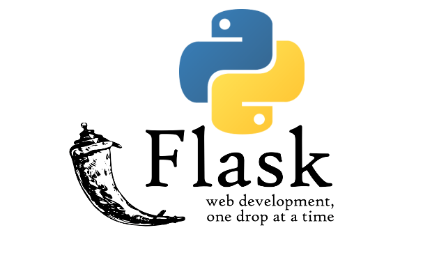

# Гайд по Flask: от основ до продвинутых техник



Flask — это микрофреймворк для создания веб-приложений на Python. Он прост в изучении, но мощный enough для создания сложных приложений. Давайте разберём его от основ до продвинутых возможностей.

## **1. Установка и минимальное приложение**

### Установка Flask:
```bash
pip install flask
```

### Простейшее приложение (`app.py`):
```python
from flask import Flask
app = Flask(__name__)

@app.route('/')
def hello():
    return "Привет, мир!"

if __name__ == '__main__':
    app.run(debug=True)
```

Запуск:
```bash
python app.py
```
→ Открываем http://localhost:5000

## **2. Основные концепции Flask**

### Маршрутизация (Routing)
```python
@app.route('/user/<username>')
def show_user(username):
    return f'Пользователь: {username}'
```

### HTTP-методы:
```python
@app.route('/login', methods=['GET', 'POST'])
def login():
    if request.method == 'POST':
        return "Обработка входа"
    return "Форма входа"
```

### Шаблоны (Jinja2)
```python
from flask import render_template

@app.route('/hello/<name>')
def hello(name):
    return render_template('hello.html', name=name)
```

Файл `templates/hello.html`:
```html
<!DOCTYPE html>
<html>
<head>
    <title>Приветствие</title>
</head>
<body>
    <h1>Привет, {{ name }}!</h1>
</body>
</html>
```

## **3. Работа с формами**

### Установка Flask-WTF:
```bash
pip install flask-wtf
```

### Пример формы:
```python
from flask_wtf import FlaskForm
from wtforms import StringField, SubmitField

class MyForm(FlaskForm):
    name = StringField('Имя')
    submit = SubmitField('Отправить')
```

### Обработка формы:
```python
@app.route('/form', methods=['GET', 'POST'])
def form():
    form = MyForm()
    if form.validate_on_submit():
        return f'Привет, {form.name.data}!'
    return render_template('form.html', form=form)
```

## **4. Работа с базой данных (SQLAlchemy)**

### Установка:
```bash
pip install flask-sqlalchemy
```

### Настройка:
```python
from flask_sqlalchemy import SQLAlchemy

app.config['SQLALCHEMY_DATABASE_URI'] = 'sqlite:///site.db'
db = SQLAlchemy(app)

class User(db.Model):
    id = db.Column(db.Integer, primary_key=True)
    username = db.Column(db.String(20), unique=True, nullable=False)
```

### Использование:
```python
@app.route('/user/<username>')
def add_user(username):
    user = User(username=username)
    db.session.add(user)
    db.session.commit()
    return f'Добавлен пользователь {username}'
```

## **5. Аутентификация (Flask-Login)**

### Установка:
```bash
pip install flask-login
```

### Настройка:
```python
from flask_login import LoginManager, UserMixin, login_user

login_manager = LoginManager(app)

class User(UserMixin, db.Model):
    # ... (как в предыдущем примере)
```

### Защита маршрутов:
```python
from flask_login import login_required

@app.route('/protected')
@login_required
def protected():
    return "Только для авторизованных!"
```

## **6. REST API с Flask**

### Простой API:
```python
from flask import jsonify

@app.route('/api/users')
def get_users():
    users = User.query.all()
    return jsonify([{'id': u.id, 'name': u.username} for u in users])
```

### Использование Flask-RESTful:
```bash
pip install flask-restful
```

Пример:
```python
from flask_restful import Resource, Api

api = Api(app)

class UserResource(Resource):
    def get(self, user_id):
        user = User.query.get_or_404(user_id)
        return {'username': user.username}

api.add_resource(UserResource, '/api/users/<int:user_id>')
```

## **7. Развёртывание (Deployment)**

### Настройка для продакшена:
```python
app.config.update(
    DEBUG=False,
    SECRET_KEY='real_secret_key_here'
)
```

### Популярные варианты деплоя:
1. **WSGI сервер (Gunicorn)**:
   ```bash
   pip install gunicorn
   gunicorn -w 4 app:app
   ```

2. **Docker**:
   ```dockerfile
   FROM python:3.9
   WORKDIR /app
   COPY . .
   RUN pip install -r requirements.txt
   CMD ["gunicorn", "-w", "4", "app:app"]
   ```

3. **Platform as a Service**:
   - Heroku
   - PythonAnywhere
   - Google App Engine

## **8. Полезные расширения**

| Расширение | Назначение |
|------------|------------|
| Flask-Mail | Отправка email |
| Flask-Migrate | Миграции базы данных |
| Flask-SocketIO | Веб-сокеты |
| Flask-Caching | Кэширование |
| Flask-Admin | Админ-панель |

## **9. Лучшие практики**

1. **Структура проекта**:
   ```
   /myapp
     /static
     /templates
     /models
     /views
     __init__.py
     config.py
   ```

2. **Конфигурация через классы**:
   ```python
   class Config:
       SECRET_KEY = 'dev_key'
       SQLALCHEMY_DATABASE_URI = 'sqlite:///site.db'

   app.config.from_object(Config)
   ```

3. **Фабрика приложений**:
   ```python
   def create_app(config_class=Config):
       app = Flask(__name__)
       app.config.from_object(config_class)
       # Инициализация расширений
       return app
   ```

## **10. Что дальше?**

1. Изучите **Flask Blueprints** для модульных приложений
2. Попробуйте **GraphQL с Flask (Ariadne)**
3. Посмотрите **Flask + React/Vue** для SPA
4. Исследуйте **асинхронный Flask (Quart)**

Flask — это gateway drug в мир веб-разработки на Python. Начните с простого и постепенно усложняйте свои проекты! 🚀

**Примеры кода:** [Официальная документация Flask](https://flask.palletsprojects.com/)  
**Готовые проекты:** [Awesome Flask](https://github.com/humiaozuzu/awesome-flask)