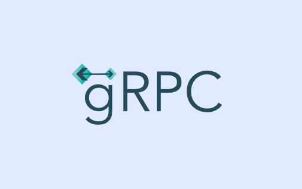

# Гайд по gRPC

---
 

gRPC — это современный фреймворк для удаленного вызова процедур (RPC), разработанный Google. Он позволяет приложениям взаимодействовать друг с другом так, как будто они находятся на одном сервере, используя HTTP/2 для передачи данных и Protocol Buffers (protobuf) для сериализации. gRPC поддерживает множество языков программирования и обеспечивает высокую производительность и эффективность при передаче данных.

Если вы работаете с микросервисной архитектурой или хотите улучшить взаимодействие между сервисами, gRPC станет отличным выбором.

1. **Основные концепции gRPC**

Перед тем как начать работу с gRPC, важно понять его ключевые компоненты:

- **Сервис (Service)**: Определение интерфейса, который включает в себя методы, доступные для удаленного вызова.
- **Клиент (Client)**: Приложение, которое вызывает методы сервиса.
- **Сервер (Server)**: Приложение, которое реализует методы сервиса и обрабатывает запросы клиентов.
- **Protocol Buffers (protobuf)**: Формат сериализации данных, используемый для определения структуры сообщений.
- **Канал (Channel)**: Абстракция, представляющая соединение между клиентом и сервером.

2. **Установка gRPC**

Для начала работы вам нужно установить gRPC. Вот несколько популярных способов:

- **Установка на Python**

Установите необходимые пакеты:
```bash
pip install grpcio grpcio-tools
```

- **Установка на другие языки**

gRPC поддерживает множество языков программирования, таких как Go, Java, C++ и другие. Подробные инструкции по установке можно найти на [официальном сайте gRPC](https://grpc.io/docs/languages/).

3. **Базовые команды и примеры**

gRPC используется для определения сервисов и генерации кода для клиента и сервера. Вот пример простого сервиса на Python:

- **Определение сервиса (proto-файл)**

Создайте файл `service.proto`:
```proto
syntax = "proto3";

service MyService {
  rpc SayHello (HelloRequest) returns (HelloResponse);
}

message HelloRequest {
  string name = 1;
}

message HelloResponse {
  string message = 1;
}
```

- **Генерация кода**

Используйте `protoc` для генерации кода:
```bash
python -m grpc_tools.protoc -I. --python_out=. --grpc_python_out=. service.proto
```

- **Реализация сервера**

Создайте файл `server.py`:
```python
import grpc
from concurrent import futures
import service_pb2
import service_pb2_grpc

class MyServiceServicer(service_pb2_grpc.MyServiceServicer):
    def SayHello(self, request, context):
        return service_pb2.HelloResponse(message=f'Hello, {request.name}!')

server = grpc.server(futures.ThreadPoolExecutor(max_workers=10))
service_pb2_grpc.add_MyServiceServicer_to_server(MyServiceServicer(), server)
server.add_insecure_port('[::]:50051')
server.start()
server.wait_for_termination()
```

- **Реализация клиента**

Создайте файл `client.py`:
```python
import grpc
import service_pb2
import service_pb2_grpc

channel = grpc.insecure_channel('localhost:50051')
stub = service_pb2_grpc.MyServiceStub(channel)
response = stub.SayHello(service_pb2.HelloRequest(name='World'))
print(response.message)
```

4. **Мониторинг и логирование**

Для мониторинга gRPC-сервисов можно использовать такие инструменты, как:
- **Prometheus**: Сбор метрик.
- **Grafana**: Визуализация данных.

5. **Советы по оптимизации**

- **Используйте аутентификацию**: Защитите ваши gRPC-сервисы с помощью TLS.
- **Оптимизируйте производительность**: Используйте асинхронные вызовы и настройте параметры HTTP/2.
- **Управляйте ресурсами**: Установите лимиты на использование ресурсов для клиентов и серверов.

**Заключение**

gRPC — мощный инструмент для создания высокопроизводительных и масштабируемых микросервисов. Начав с базовых концепций и освоив основные команды, вы сможете эффективно использовать его возможности. Помните, что работа с gRPC требует практики, поэтому не бойтесь экспериментировать!

Готовы начать? Удачи в изучении gRPC! 🚀

---

Этот гайд поможет вам начать работу с gRPC и понять его основные концепции и возможности.