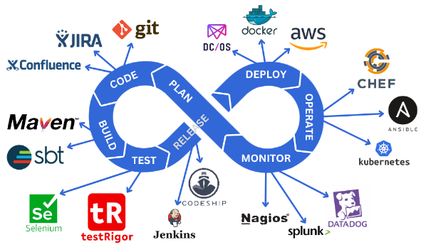
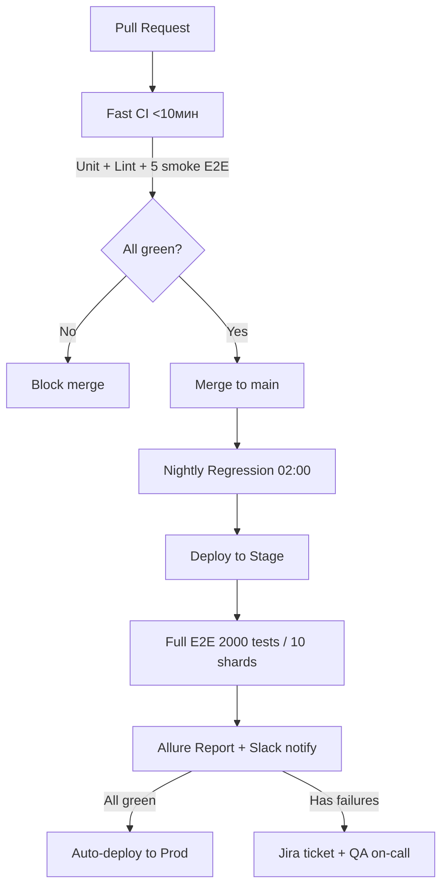

# Гайд по CI/CD



**CI/CD (Continuous Integration / Continuous Delivery / Continuous Deployment)** — это практика автоматизации процессов разработки, тестирования и развертывания кода.

В контексте работы автотестировщика и разработчика **CI/CD** — это система, которая забирает ваш код из репозитория, прогоняет все тесты, собирает артефакты и выкатывает их на окружения (dev / stage / prod). Человек перестаёт быть «узким горлом» — всё делает машина.

Главная фишка CI/CD в том, что вы перестаёте бояться релизов. Коммит в `main` → автоматический запуск проверок → если всё зелено — код в продакшене.

---

## Ключевые концепции

Чтобы понимать, как работают CI/CD-пайплайны, нужно разобраться с основными понятиями.

- **CI (Continuous Integration)** — непрерывная интеграция. Разработчики часто мержат код в общую ветку (несколько раз в день). При каждом мерже автоматически запускаются сборка и тесты. Цель — найти ошибки на ранней стадии.
- **CD (Continuous Delivery)** — непрерывная доставка. Код всегда готов к выкатке в продакшен. После успешного CI артефакт автоматически деплоится на stage-окружение, а релиз в прод происходит нажатием одной кнопки (или по расписанию).
- **CD (Continuous Deployment)** — непрерывное развертывание. Крайняя степень автоматизации: каждый успешный коммит в `main` автоматически улетает в продакшен. Без кнопок, без ручного approval.
- **Pipeline (пайплайн)** — последовательность автоматических шагов (джобов), которые выполняются при определённых событиях (push, pull request, merge). Это «сценарий» вашего CI/CD-процесса.
- **Job (джоба)** — отдельная единица работы внутри пайплайна. Например: `build`, `run_tests`, `deploy_to_stage`, `notify_team`. Джобы могут выполняться последовательно или параллельно.
- **Stage (стадия)** — логическая группировка джобов. Например, стадия `test` может содержать джобы `unit_tests`, `integration_tests`, `e2e_tests`.
- **Artifact (артефакт)** — результат сборки, который передаётся дальше. Docker-образ, `.jar`/`.exe`-файл, отчёты о тестах, `node_modules`. Артефакты передаются между джобами и стадиями.
- **Runner / Agent** — исполнитель: машина (виртуальная, Docker-контейнер, физический сервер), на которой запускаются ваши джобы. GitHub Actions называет их `runners`, GitLab — `runners`, Jenkins — `agents`, TeamCity — `build agents`.

---

## Структура CI/CD-пайплайна

Типичный пайплайн выглядит как лесенка шагов:

```
[Push / PR в main]
       │
       ▼
┌─────────────────┐
│  Стадия: Build  │  ← Собрать код, установить зависимости
│  - install      │  ← Сохранить артефакты
│  - compile      │
└────────┬────────┘
         │
         ▼
┌─────────────────┐
│ Стадия: Test    │  ← Параллельные джобы
│  - unit_tests   │
│  - lint         │
│  - integration  │
│  - e2e (smoke)  │
└────────┬────────┘
         │
         ▼ (если всё зелено)
┌─────────────────┐
│ Стадия: Build   │  ← Собрать production-артефакт
│    Image        │  ← Собрать Docker-образ
└────────┬────────┘
         │
         ▼
┌─────────────────┐
│ Стадия: Deploy  │  ← Выкатить на Stage
│   to Stage      │  ← Запустить smoke-тесты
└────────┬────────┘
         │
         ▼ (в Delivery — стоп, в Deployment — автоматом)
┌─────────────────┐
│ Стадия: Deploy  │  ← Выкатить в Production
│   to Prod       │
└─────────────────┘
```

---

## Схема работы (Step-by-Step)

Процесс CI/CD на примере GitHub Actions:

1. **Разработчик** пушит код в ветку `feature/login` и открывает Pull Request (PR) в `main`.
2. **CI-система** автоматически запускает пайплайн:
   - Поднимает свежий runner (виртуалку с Ubuntu).
   - Выполняет `checkout` кода.
   - Стадия `build`: `npm ci` + `npm run build` (собирает приложение).
   - Стадия `test`: параллельно запускает `unit tests`, `lint`, `integration tests`, `e2e tests` (Playwright/Cypress).
3. Если все тесты прошли — в PR появляется зелёная галочка «All checks passed».
4. **Ревьюер** мержит PR в `main`.
5. **На событие `push` в `main`** запускается следующий пайплайн:
   - Собирает Docker-образ.
   - Пушит его в registry (Docker Hub / AWS ECR / GitLab Registry).
   - Деплоит на `stage`-окружение.
   - Запускает smoke-тесты на stage.
6. (Если настроен **Continuous Deployment**) — автоматически катит в `production`.

---

## CI/CD для автотестировщика (AQA)

Для вас CI/CD — это лучший друг. Вы перестаёте запускать тесты локально и начинаете:

- **Запускать регресс автоматически** по ночам или по расписанию.
- **Параллелить тесты** на 10–50 runner'ах (вместо одной машины).
- **Получать отчёты** (Allure, ReportPortal, JUnit XML) прямо в PR или в чат.
- **Деплоить тестовые стенды** для каждой ветки (review apps).

### Пример: как добавить E2E-тесты в CI (GitHub Actions)

```yaml
name: E2E Tests on PR

on:
  pull_request:
    branches: [ main, develop ]

jobs:
  build-and-test:
    runs-on: ubuntu-latest
    steps:
      - uses: actions/checkout@v4
      
      - name: Setup Node.js
        uses: actions/setup-node@v4
        with:
          node-version: '20'
      
      - name: Install dependencies
        run: npm ci
      
      - name: Run unit tests
        run: npm run test:unit
      
      - name: Build app
        run: npm run build
      
      - name: Run Playwright E2E tests
        run: npm run test:e2e
      
      - name: Upload Playwright report
        if: always()
        uses: actions/upload-artifact@v4
        with:
          name: playwright-report
          path: playwright-report/
```

---

## Сравнение популярных CI/CD-систем

| **Система**       | **Плюсы**                                                                 | **Минусы**                                                | **Когда брать**                                      |
|-------------------|---------------------------------------------------------------------------|-----------------------------------------------------------|------------------------------------------------------|
| **GitHub Actions**| Тесно встроен в GitHub. Огромный marketplace. Бесплатно для public repos. | Сложный синтаксис у больших пайплайнов.                   | Маленькие и средние проекты на GitHub.               |
| **GitLab CI**     | Всё в одном: репозиторий + CI/CD + registry. Хороший autoscaling runner'ов.| Тяжелее в администрировании.                              | Когда вы и так на GitLab.                           |
| **Jenkins**       | Всё можно настроить. Тысячи плагинов. Работает с чем угодно.              | Нужно администрировать сервер. Устаревший UX.             | Legacy-проекты или полное кастомное решение.        |
| **TeamCity**      | Отличный UI. Умные цепочки сборок.                                        | Платная (кроме малых проектов).                           | Enterprise на JetBrains-стеке.                      |
| **CircleCI**      | Быстрые кеши. Хороший оркестр параллельных джобов.                        | Дорогой при большом количестве билдов.                    | Стартапы, которым важна скорость.                   |

---

## Как тестировать пайплайны? (Для AQA)

Тестировать CI/CD — не самая очевидная задача, но вот подходы.

1. **Проверьте, что пайплайн запускается на нужных событиях**:
   - push в любую ветку;
   - pull request (открытие, обновление, merge);
   - расписание (cron);
   - ручной запуск (`workflow_dispatch`).

2. **Проверьте failure-сценарии**:
   - Что будет, если упадут unit-тесты? (пайплайн красный, деплой не идёт)
   - Что будет, если сломалась сборка (`build`)?
   - Что будет, если истекло время выполнения джобы (`timeout`)?

3. **Проверьте артефакты**:
   - Сохраняются ли логи, скриншоты, видео с упавших E2E-тестов?
   - Можно ли скачать артефакты после завершения?

4. **Проверьте параллельность**:
   - Запускаются ли независимые джобы параллельно?
   - Не падают ли тесты из-за гонки (если пишут в одну БД)?

5. **Проверьте кеширование**:
   - `node_modules`, `pip cache`, `.gradle` — кешируются ли они? (иначе билд будет 10 минут вместо 1)

6. **Проверьте security**:
   - Секреты (API-ключи, токены) не зашиты в коде, а берутся из CI/CD secrets.

---

## 🚀 Важные термины и паттерны

- **Pipeline as Code (PaC)** — пайплайн описывается в файле (`.yml`, `.gitlab-ci.yml`, `Jenkinsfile`) и лежит в репозитории рядом с кодом. Это версионирует, упрощает review и позволяет ветвить логику.
- **Matrix / Parallel Matrix** — запуск одной и той же джобы с разными параметрами. Например: тесты на Node 16, 18, 20 + Windows, Mac, Linux.
- **Caching** — сохранение временных файлов (зависимости, билд-кэш) между прогонами, чтобы ускорить пайплайн.
- **Artifact** — файлы, которые переживают джобу: отчёты, бинарники, скриншоты.
- **Self-hosted runner** — ваш собственный сервер, на котором крутится CI. Нужен, если вам нужен доступ к внутренней сети, GPU или большим ресурсам.
- **Trunk-based development** — ветка `main` единственная. Разработка через короткие ветки (менее одного дня). CI/CD настроен так, чтобы быстро и безболезненно мержить.

---

## Как создать идеальный пайплайн для автотестирования веб-приложения?

«Идеального» пайплайна не существует — он зависит от приложения, команды и бюджета. Но есть **золотые принципы**, которые превращают хаос в надёжную систему. Ниже — 7 ключевых слоёв.

---

#### Слой 1: Стратегия триггеров (когда запускается)

Один пайплайн — это слишком мало. Нужны **3 типа пайплайнов**:

| **Тип**              | **Триггер**                                     | **Что запускаем**                                              | **Таймаут** |
|----------------------|-------------------------------------------------|----------------------------------------------------------------|-------------|
| **Fast CI**          | На каждый PR (push)                             | Линтеры, юнит-тесты, сборка, 5–10 быстрых smoke E2E            | 10 минут    |
| **Full Regression**  | По расписанию (ночь / обед) или лейблу `[full-tests]` | Полный регресс (все E2E, кроссбраузер, визуальные тесты)       | 2–4 часа    |
| **Deployment pipeline** | После успешного деплоя на stage/prod          | Smoke-тесты на свежем окружении + мониторинг                   | 15 минут    |

**Почему так?** Если на каждый коммит гонять 2000 тестов по 2 часа — разработчики возненавидят вас. Быстрая обратная связь (<10 минут) — это святое.

---

#### Слой 2: Структура пайплайна (стадии и параллелизм)

Пример стадий:

```yaml
stages:
  - lint_and_unit      # 2 минуты
  - build_and_deploy   # 5 минут (поднимает свежий стенд)
  - e2e_smoke          # 3 минуты (критический путь)
  - e2e_parallel       # 30 минут (10 джоб × 3 минуты)
  - reporting          # 1 минута (сборка Allure/ReportPortal)
```

**Ключевые решения:**

- **Fail-fast**: если `lint_and_unit` упал — пайплайн останавливается. Зачем запускать E2E на заведомо битом коде?
- **Параллелизм с шардированием**:  
  Разбиваем 1000 тестов на 10 групп по 100 тестов:
  ```
  job-e2e-shard-1: playwright test --shard=1/10
  job-e2e-shard-2: playwright test --shard=2/10
  ...
  ```
  Время выполнения падает с 60 минут до 6–8 минут.
- **Retry-политика**: упавшие тесты перезапускаются 1 раз (если тест флапит из-за сети). Но не больше — иначе вы прячете реальные баги.

---

#### Слой 3: Окружение и зависимости

**Проблема:** тесты падают на CI, но проходят локально — классика.

**Решение — изоляция:**

- Каждый runner получает **свежий Docker-контейнер** с приложением и БД (PostgreSQL в памяти или testcontainers).
- Используем **docker-compose** для поднятия всего стека: app, db, redis, mock-сервисы.
- **Никаких общих ресурсов** между параллельными шардами (разные БД, разные папки, разные user_id).

```yaml
# Пример для GitHub Actions с Docker Compose
jobs:
  e2e:
    runs-on: ubuntu-latest
    services:
      postgres:
        image: postgres:15
        env:
          POSTGRES_DB: test_db_${{ github.run_id }}_${{ strategy.job-index }}
      app:
        image: myapp:latest
        ports:
          - 3000:3000
    steps:
      - run: npm run test:e2e
```

---

#### Слой 4: Данные для тестов (фикстуры и очистка)

**Золотое правило:** тесты не должны знать о других тестах.

| **Подход**                          | **Как работает**                                    | **Скорость** | **Надёжность** |
|-------------------------------------|-----------------------------------------------------|--------------|----------------|
| Database transaction rollback       | Каждый тест в транзакции → откат в конце            | Очень быстро | Средняя        |
| Unique data per test                | `user_${timestamp}_${random}`                      | Быстро       | Высокая        |
| Fresh DB per shard                  | Поднять новую БД для каждой группы тестов           | Медленно     | Очень высокая  |

**Для E2E-тестов веб-приложения я выбираю комбинацию:**
- Свежая БД на каждый шард (через Docker volume или snapshot).
- В тестах — уникальные email/username через `test-${Date.now()}-${crypto.randomUUID()}`.

---

#### Слой 5: Отчётность и артефакты

Пайплайн без отчётов — это чёрный ящик. Должно быть:

1. **JUnit XML** — чтобы CI понимал, сколько тестов упало/прошло.
2. **Allure / ReportPortal** — красивый HTML-отчёт с шагами, скриншотами, логами.
3. **Скриншоты и видео** упавших тестов (Playwright/Cypress/Selenide делают автоматически).
4. **Trace Viewer** (Playwright) — кликабельный трейс каждого действия.
5. **Логи приложения** (если контейнер упал — сохранить stdout/stderr как артефакт).

```yaml
- name: Upload test artifacts
  if: always()
  uses: actions/upload-artifact@v4
  with:
    name: test-results-${{ github.run_id }}
    path: |
      test-results/
      playwright-report/
      logs/
    retention-days: 7
```

---

#### Слой 6: Уведомления (кто и когда узнаёт)

| **Событие**                     | **Кому**              | **Куда**                        | **Что пишем**                                      |
|--------------------------------|-----------------------|---------------------------------|----------------------------------------------------|
| Пайплайн упал на `main`        | Вся команда + тимлид  | Slack #general + email          | «Красный main! @here» + ссылка                     |
| Пайплайн упал на PR            | Только автор PR       | Slack DM или комментарий в PR   | «Тесты упали, смотри отчёт»                        |
| Регресс ночью упал             | QA-команда            | Slack #qa-alerts + Jira-тикет   | Таблица: упавшие тесты (топ-10)                    |
| Всё зелено                     | Никому (не спамим)    | —                               | —                                                  |

**Важно:** использовать `@here` только при падении `main`. Иначе люди привыкнут и перестанут реагировать.

---

#### Слой 7: Метрики и мониторинг

Вы не можете улучшить то, что не измеряете. Собирайте:

- **Время выполнения пайплайна** (должно падать или хотя бы не расти).
- **Flaky rate** — процент тестов, которые упали, а при перезапуске прошли. Норма <2%. Выше — чините или удаляйте тест.
- **Стабильность окружения** — сколько раз упал не тест, а CI runner / Docker / сеть.
- **Top-10 самых долгих тестов** (кандидаты на оптимизацию или сплит).

```yaml
- name: Send test metrics
  run: |
    curl -X POST "https://api.datadoghq.com/api/v1/series" \
      -d "{\"series\":[{\"metric\":\"ci.test.duration\",\"points\":[[$(date +%s), $DURATION]]}]}"
```

---

#### Итоговая архитектура «идеального» пайплайна



#### Чек-лист для самопроверки

- [ ] Fast CI <10 минут для 95% PR
- [ ] Тесты не зависят друг от друга (порядок не важен)
- [ ] Упавшие тесты оставляют скриншоты + видео + логи
- [ ] Flaky rate <2% (отслеживается автоматически)
- [ ] Есть ночной полный регресс
- [ ] Уведомления не спамят, а бьют точно в цель
- [ ] Параллельные шарды не используют общие ресурсы
- [ ] Можно локально воспроизвести любой упавший тест из CI
- [ ] Отчёт в Allure/ReportPortal доступен по ссылке из PR
- [ ] На main нельзя замержить код с красным пайплайном (branch protection)

#### Резюме для собеседования

> *«Идеальный пайплайн — это не тот, который никогда не падает, а тот, который:*
> 1. *Быстро говорит разработчику, что он сломал (<10 минут).*
> 2. *Надёжно изолирует окружение (Docker + свежая БД).*
> 3. *Понятно показывает, что именно упало и почему (скриншоты, трейсы, логи).*
> 4. *Не требует ручного вмешательства — от коммита до отчёта.*
> 5. *Сам сообщает о флаках и долгих тестах, чтобы их чинили.*
>
> *Мы в команде постоянно улучшаем метрики: время пайплайна, стабильность, flaky rate. И да, мы не гоним 2000 тестов на каждый коммит — для этого есть ночной регресс.»*

---

## Заключение

CI/CD — это не просто «модные слова», а реальный способ перестать бояться релизов и начать получать удовольствие от разработки. Для автотестировщика CI/CD открывает возможность запускать тысячи тестов параллельно, видеть отчёты в каждом PR и спать спокойно — потому что прод не сломается без вашего ведома.

Освоив этот гайд, вы сможете:
- объяснить разницу между CI, Delivery и Deployment;
- написать простой пайплайн для E2E-тестов;
- ответить на вопросы на собеседовании;
- и самое главное — перестать запускать тесты локально вручную.