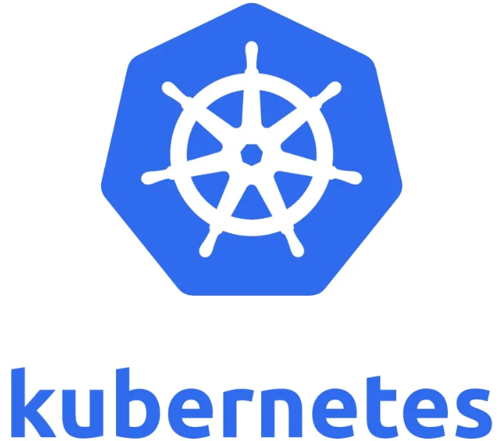

# Гайд по Kubernetes: Основы и Практическое Применение

---
 

## **Введение в Kubernetes**

Kubernetes (или сокращенно k8s) — это открытая платформа для автоматизации развертывания, масштабирования и управления контейнеризированными приложениями. Она была разработана Google и теперь поддерживается Cloud Native Computing Foundation (CNCF). Kubernetes позволяет управлять кластерами серверов, на которых работают контейнеры (например, Docker), обеспечивая отказоустойчивость, масштабируемость и удобство управления.

Если вы работаете с микросервисной архитектурой или хотите автоматизировать процессы развертывания, Kubernetes станет вашим надежным помощником.

---

## **1. Основные концепции Kubernetes**

Перед тем как начать работу с Kubernetes, важно понять его ключевые компоненты:

- **Кластер (Cluster):** Совокупность машин (нод), которые управляются Kubernetes.
  - **Master Node:** Узел, отвечающий за управление кластером.
  - **Worker Node:** Узлы, на которых запускаются контейнеры.

- **Pod:** Наименьшая единица развертывания в Kubernetes. Pod может содержать один или несколько контейнеров, которые работают вместе.

- **Deployment:** Объект, который управляет созданием и обновлением Pods.

- **Service:** Обеспечивает доступ к группе Pods через стабильный IP-адрес и DNS-имя.

- **Namespace:** Логическое разделение кластера для организации ресурсов.

- **ConfigMap и Secret:** Используются для хранения конфигураций и чувствительных данных (например, паролей).

- **Persistent Volume (PV) и Persistent Volume Claim (PVC):** Механизмы для работы с постоянным хранилищем.

---

## **2. Установка Kubernetes**

Для начала работы вам нужно установить Kubernetes. Вот несколько популярных способов:

## **Локальная установка (Minikube)**
Minikube — это инструмент для запуска Kubernetes локально. Он создает однокластерную среду на вашем компьютере.

1. Установите Minikube:
   ```bash
   curl -LO https://storage.googleapis.com/minikube/releases/latest/minikube-linux-amd64
   sudo install minikube-linux-amd64 /usr/local/bin/minikube
   ```

2. Запустите Minikube:
   ```bash
   minikube start
   ```

3. Проверьте статус:
   ```bash
   kubectl get nodes
   ```

## **Установка на облачных платформах**
Если вы хотите использовать Kubernetes в облаке, рассмотрите следующие сервисы:
- **Google Kubernetes Engine (GKE):** Платформа Google Cloud.
- **Amazon Elastic Kubernetes Service (EKS):** AWS.
- **Azure Kubernetes Service (AKS):** Microsoft Azure.

---

## **3. Базовые команды Kubernetes**

Kubernetes управляется через CLI-инструмент `kubectl`. Вот основные команды:

- **Просмотр состояния кластера:**
  ```bash
  kubectl cluster-info
  ```

- **Создание Deployment:**
  ```bash
  kubectl create deployment my-app --image=nginx
  ```

- **Просмотр Pods:**
  ```bash
  kubectl get pods
  ```

- **Масштабирование Deployment:**
  ```bash
  kubectl scale deployment my-app --replicas=3
  ```

- **Обновление образа контейнера:**
  ```bash
  kubectl set image deployment/my-app nginx=nginx:1.21
  ```

- **Удаление Deployment:**
  ```bash
  kubectl delete deployment my-app
  ```

---

## **4. Создание и управление ресурсами через YAML**

Kubernetes использует файлы YAML для описания объектов. Вот пример файла `deployment.yaml`:

```yaml
apiVersion: apps/v1
kind: Deployment
metadata:
  name: my-app
spec:
  replicas: 3
  selector:
    matchLabels:
      app: my-app
  template:
    metadata:
      labels:
        app: my-app
    spec:
      containers:
      - name: nginx
        image: nginx:1.21
        ports:
        - containerPort: 80
```

Чтобы применить этот файл:
```bash
kubectl apply -f deployment.yaml
```

Чтобы удалить ресурсы:
```bash
kubectl delete -f deployment.yaml
```

---

## **5. Работа с сервисами**

Сервисы позволяют организовать доступ к Pods. Например, создадим Service для нашего Deployment:

```yaml
apiVersion: v1
kind: Service
metadata:
  name: my-app-service
spec:
  selector:
    app: my-app
  ports:
    - protocol: TCP
      port: 80
      targetPort: 80
  type: LoadBalancer
```

Применяем:
```bash
kubectl apply -f service.yaml
```

После этого Kubernetes создаст балансировщик нагрузки, и вы сможете получить доступ к вашему приложению.

---

## **6. Мониторинг и логирование**

Для мониторинга кластера Kubernetes используются такие инструменты, как:
- **Prometheus:** Сбор метрик.
- **Grafana:** Визуализация данных.
- **Kibana и Elasticsearch:** Логирование.

---

## **7. Советы по оптимизации**

- **Используйте Namespaces:** Разделяйте ресурсы по проектам или командам.
- **Автоматизируйте деплой:** CI/CD-конвейеры помогут ускорить процесс развертывания.
- **Ограничьте ресурсы:** Установите лимиты CPU и памяти для контейнеров.
- **Используйте Helm Charts:** Helm — это менеджер пакетов для Kubernetes, который упрощает развертывание сложных приложений.

---

## **Заключение**

Kubernetes — мощный инструмент для управления контейнеризированными приложениями. Начав с базовых концепций и освоив основные команды, вы сможете эффективно использовать его возможности. Помните, что работа с Kubernetes требует практики, поэтому не бойтесь экспериментировать!

Если у вас есть вопросы или вы хотите углубиться в конкретные темы, напишите комментарий ниже, и я помогу разобраться.

---

**Готовы начать? Удачи в изучении Kubernetes!** 🚀