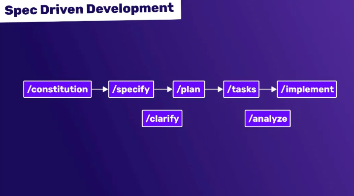

# Гайд по API: Spec-Driven Development (Разработка через спецификацию)



**Spec-Driven Development (SDD)** — это методология разработки программного обеспечения, в которой **спецификация (контракт) API является источником истины (Single Source of Truth)**. В отличие от классического подхода "сначала код, потом документация", здесь сначала создается или согласовывается спецификация (например, в формате OpenAPI/Swagger), и только затем на ее основе пишется код (как на бэкенде, так и на фронтенде).

Главная фишка SDD в том, что она позволяет командам (бэкенд, фронтенд, мобильные разработчики, AQA) работать параллельно, опираясь на единый, живой документ, который всегда актуален, потому что именно он управляет процессом разработки.

## Ключевые концепции

Чтобы понять, как работает SDD, нужно разобраться с тремя основными ролями спецификации:

- **Contract-First (Контракт в первую очередь)**: Подход, при котором написание кода начинается только после того, как спецификация API согласована со всеми стейкхолдерами (фронтенд, безопасность, тестирование).
- **Single Source of Truth (Единый источник истины)**: Спецификация (файл `openapi.yaml` или `proto`) является единственным документом, описывающим API. Документация, моки (заглушки) и даже код валидаторов генерируются из нее автоматически.
- **Mock Server (Сервер-заглушка)**: Инструмент, который по спецификации мгновенно создает работающий фейковый API. Это позволяет фронтенд-разработчикам начинать интеграцию, даже пока бэкенд еще пишет код.
- **Code Generation (Генерация кода)**: Автоматическое создание скелета контроллеров (для бэкенда), типов (TypeScript для фронтенда) или клиентских SDK на основе спецификации.

## Структура спецификации (OpenAPI Example)

Спецификация обычно представляет собой файл в формате YAML или JSON. В ней описывается всё: эндпоинты, методы, заголовки, тела запросов, коды ответов и модели данных.

```yaml
openapi: 3.0.0
info:
  title: User API
  version: 1.0.0
paths:
  /users/{id}:
    get:
      summary: Get user by ID
      parameters:
        - name: id
          in: path
          required: true
          schema:
            type: integer
      responses:
        '200':
          description: Successful response
          content:
            application/json:
              schema:           # <-- Это Single Source of Truth для модели данных
                $ref: '#/components/schemas/User'
        '404':
          description: User not found
components:
  schemas:
    User:
      type: object
      properties:
        id:
          type: integer
        name:
          type: string
      required:
        - id
        - name
```

*Важно:* В SDD эта спецификация лежит в репозитории и ревьюится на Pull Request'ах так же строго, как и обычный код. Изменение спецификации без обсуждения с фронтендом считается нарушением процесса.

## Схема работы (Step-by-Step)

Процесс разработки фичи в парадигме SDD выглядит так:

1.  **Анализ и проектирование**: Команда (бэкенд, фронтенд, аналитик) обсуждает новую фичу. Вместо того чтобы сразу лезть в код, они идут в редактор спецификаций (Stoplight, Swagger Editor).
2.  **Создание спецификации**: Бэкенд-разработчик пишет или правит `openapi.yaml`, описывая новый эндпоинт, структуру запроса и ответа.
3.  **Согласование (Review)**: Фронтенд-разработчик смотрит спецификацию. Если ему не хватает поля или неудобен формат даты, он отклоняет PR со спецификацией. Обсуждение идет на уровне структуры JSON, а не на уровне кода Python/Java.
4.  **Генерация мок-сервера**: После мержа спецификации CI/CD автоматически поднимает **Mock Server**. Фронтенд сразу же начинает писать код, отправляя запросы на этот мок-сервер, получая реалистичные ответы.
5.  **Параллельная разработка**:
    - **Бэкенд** использует спецификацию для генерации скелета контроллеров (интерфейсов) и пишет бизнес-логику, следя за тем, чтобы код соответствовал контракту.
    - **Фронтенд** использует спецификацию для генерации TypeScript-типов (типизация) или SDK. Он уверен, что когда бэкенд закончит, структура данных не поменяется.
6.  **Тестирование контракта (Contract Testing)**: AQA или сам бэкенд запускают тесты, которые проверяют, что реальный работающий сервер соответствует спецификации (не возвращает лишних полей, правильно валидирует обязательные параметры).

## Инструменты экосистемы SDD

| **Инструмент** | **Назначение** |
|---|---|
| **OpenAPI (Swagger)** | Самый популярный стандарт описания REST API. |
| **AsyncAPI** | Аналог OpenAPI, но для событийных архитектур (Kafka, WebSockets). |
| **GraphQL Schema** | Для GraphQL API спецификация — это сама схема (Type Definitions). |
| **Protocol Buffers (Protobuf)** | Используется в gRPC. Файл `.proto` — это спецификация. |
| **Stoplight / Postman** | Визуальные редакторы для дизайна API по принципу SDD. |
| **Prism / Microcks** | Инструменты для поднятия Mock-серверов на основе спецификации. |
| **Dredd / Spectral** | Инструменты для тестирования: проверяют, соответствует ли реальный API спецификации (Dredd) и линтинг спецификации (Spectral). |

## Сравнение: Code-First vs Spec-Driven


| **Критерий** | **Spec-Driven (Contract-First)** | **Code-First (Code-First)** |
|---|---|---|
| **Источник правды** | Файл спецификации (YAML/JSON). | Код приложения (Java, Python, PHP). |
| **Документация** | Генерируется автоматически, всегда свежая. | Часто устаревает, требует ручного обновления (Swagger-аннотации в коде). |
| **Параллельная разработка** | Возможна (фронтенд работает на моках). | Затруднена (фронтенд ждет готового бэкенда). |
| **Контроль изменений** | Высокий. Любое изменение API видно в диффе спецификации. | Низкий. Изменение может "спрятаться" в глубине кода. |
| **Скорость старта** | Медленный старт (надо написать спецификацию). | Быстрый старт (написал код — оно работает). |
| **Кто вносит изменения** | Требует согласования между командами. | Бэкенд может изменить API незаметно для фронта. |

## Тестирование в мире SDD (Для AQA)

Для тестировщика SDD — это рай, потому что неопределенность исчезает. Тестирование превращается в проверку соответствия спецификации.

1.  **Линтинг спецификации (Spectral):**
    - Проверяем, что спецификация написана по правилам (naming conventions, обязательность версионирования).
    - Автоматически на CI: `spectral lint openapi.yaml`.

2.  **Контрактное тестирование (Dredd / Pact):**
    - **Dredd**: Запускает реальный сервер и прогоняет все примеры из спецификации, проверяя статус-коды и структуру ответов.
    ```bash
    dredd openapi.yaml http://localhost:8080
    ```
    - **Pact**: Используется для микросервисов. Проверяет, что потребитель (фронтенд) и провайдер (бэкенд) понимают друг друга.

3.  **Генерация тестовых данных:**
    - Используя спецификацию, можно автоматически генерировать валидные и невалидные JSON-объекты для тестов (например, библиотеки `Faker` + схема JSON Schema).

4.  **Что проверять:**
    - **Обязательность полей**: Если в схеме поле `required: true`, а бэкенд отдал `null` — тест должен упасть.
    - **Типы данных**: Если в схеме `type: integer`, а пришел `"string"` — тест падает.
    - **Дополнительные поля**: В SDD действует принцип "Сервер не должен отдавать поля, которых нет в спецификации" (это ломает строгую типизацию на клиенте). Нужно проверять, нет ли `extra fields`.

---

## 🚀 Разбор важных практик SDD

*   **Версионирование API**: Спецификация помогает реализовывать версионирование (например, `/v1/users` и `/v2/users`). Старую спецификацию можно хранить как артефакт.
*   **Примеры (Examples)**: В спецификации обязательно нужно добавлять `examples`. Это не просто документация, эти примеры используются инструментами тестирования (Dredd) и Mock-серверами (Prism) для генерации реалистичных ответов.
*   **`$ref` (Reusability)**: Используйте ссылки, чтобы не дублировать модели. Если структура `User` изменится, она изменится везде автоматически.

---

## ❓ Вопросы с собеседований (ТОП-10)

Этот блок поможет вам подготовиться к собеседованию на позиции Manual/QA Automation и Junior/Middle Developer.

### 1. Что такое Spec-Driven Development и зачем он нужен?
**Ответ:**
Это подход, при котором спецификация API создается до написания кода и является единым источником правды. Он нужен для синхронизации работы фронтенда и бэкенда, автоматической генерации документации и возможности тестировать контракты, исключая ошибки интеграции на ранних этапах.

### 2. Чем SDD отличается от Code-First?
**Ответ:**
При **Code-First** бэкенд пишет код, а документация (Swagger) генерируется из аннотаций к коду. При **SDD** сначала пишется файл спецификации (OpenAPI), а код (скелет приложения) генерируется из него. SDD дает больше контроля над контрактом, но требует дополнительных усилий на начальном этапе.

### 3. Что такое Mock Server и зачем он нужен?
**Ответ:**
Mock Server — это заглушка API, которая поднимается на основе спецификации. Она имитирует поведение реального сервера, возвращая примеры данных. Это позволяет фронтенд-разработчикам и тестировщикам начинать работу и писать автотесты **до того**, как бэкенд написал реальную бизнес-логику.

### 4. Как тестировать API, если используется SDD?
**Ответ:**
Тестирование сводится к проверке соответствия **контракту**. Используются инструменты вроде **Dredd**, который прогоняет тесты из спецификации, или **Pact** для потребительского тестирования. Также обязательно тестируется, что сервер не возвращает лишних полей (strict mode) и правильно валидирует типы данных согласно схеме.

### 5. Что такое OpenAPI (Swagger)?
**Ответ:**
Это спецификация (стандарт) для описания RESTful API. Она описывает эндпоинты, входные параметры, форматы запросов и ответов в машиночитаемом формате (YAML/JSON). Это "язык", на котором фронтенд и бэкенд договариваются о контракте.

### 6. Как в SDD обрабатывать breaking changes?
**Ответ:**
Breaking changes (удаление поля, изменение типа с int на string) не могут быть внесены просто так. В SDD процесс требует создания **новой версии API** (например, `/v2/resource`). Старая спецификация продолжает существовать для старых клиентов. Изменения проходят код-ревью, где архитектор проверяет совместимость.

### 7. Какую роль играет AQA в SDD?
**Ответ:**
AQA в SDD перестает быть "нажимателем кнопок". Он участвует в ревью спецификации на этапе дизайна (проверяет тестируемость), настраивает контрактные тесты (Dredd) в CI/CD, а также может генерировать тестовые данные прямо из схемы спецификации, автоматизируя создание большого количества сценариев.

### 8. Что такое Spectral?
**Ответ:**
Это линтер для OpenAPI спецификаций. Он проверяет, соблюдены ли в файле `openapi.yaml` правила оформления (наличие `operationId`, правильные форматы `response`), а также кастомные правила команды (например, запрет на `GET` с телом запроса). Это помогает держать API в едином стиле.

### 9. В чем проблема подхода Code-First с аннотациями (Swagger annotations)?
**Ответ:**
Главная проблема в том, что контракт API "размазан" по коду в виде аннотаций (`@ApiOperation`, `@ApiParam`). Это приводит к дублированию кода и логики. Часто документация перестает обновляться, так как разработчики забывают править аннотации при изменении кода. Кроме того, для того чтобы показать контракт фронтенду, бэкенд должен сначала написать код и поднять сервер.

### 10. Как обеспечить, чтобы реальный сервер всегда соответствовал спецификации в CI/CD?
**Ответ:**
Настраивается пайплайн, который после сборки приложения запускает **Contract Tests** (например, Dredd или Postman Newman). Dredd читает спецификацию, отправляет реальные запросы на запущенный инстанс приложения и проверяет, что ответы соответствуют описанию. Если соответствие нарушено (появилось лишнее поле), пайплайн падает, и деплой блокируется.

---

## Заключение

Spec-Driven Development — это не просто про написание документации. Это про культуру инженерии, где на первом месте стоит **коммуникация через контракт**. Внедрение SDD позволяет ускорить разработку за счет параллелизации задач, повысить качество интеграции благодаря автоматической генерации тестов и навсегда забыть о проблеме "устаревшей документации". Для тестировщика это подход превращает хаос неопределенности в четкую систему проверок на основе машиночитаемого стандарта.