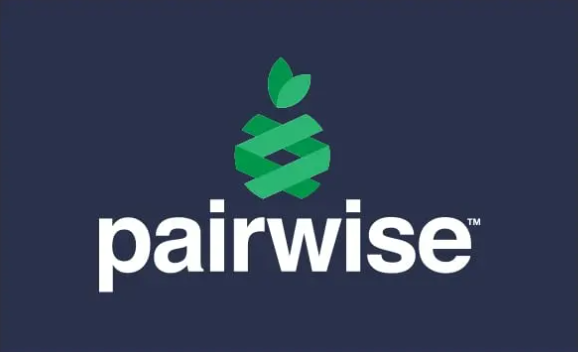

# Гайд по Pairwise тестированию

 

## **1. Что такое Pairwise тестирование?**
Pairwise (попарное) тестирование — это техника тест-дизайна, при которой тестируются **все возможные пары значений параметров**, а не все комбинации.  

🔹 **Зачем нужно?**  
Если у нас есть 5 параметров с 3 значениями каждый, то полный перебор даст `3^5 = 243` теста.  
Pairwise сократит их до **15-25**, сохраняя 80-90% покрытия ошибок!  

✅ **Когда применять:**  
- Тестирование форм с множеством полей  
- Кросс-браузерное/кросс-платформенное тестирование  
- Конфигурационное тестирование (ОС + версия ПО + железо)  

---

## **2. Разбираем пример: форма регистрации**
Допустим, тестируем форму с полями:  
1. **Браузер** (Chrome, Firefox, Safari)  
2. **ОС** (Windows, macOS, Linux)  
3. **Разрешение экрана** (1920x1080, 1366x768, 800x600)  
4. **Язык** (EN, RU)  

### 🔥 **Полный перебор:**  
`3 браузера × 3 ОС × 3 разрешения × 2 языка = 54 комбинации`  

### 🚀 **Pairwise сокращает до 9-12 тестов!**  

---

## **3. Генерируем тесты автоматически (Python + AllPairs)**
### Установка:
```bash
pip install allpairspy
```

### Код:
```python
from allpairspy import AllPairs

parameters = [
    ["Chrome", "Firefox", "Safari"],
    ["Windows", "macOS", "Linux"],
    ["1920x1080", "1366x768", "800x600"],
    ["EN", "RU"]
]

print("Pairwise тесты:")
for i, combo in enumerate(AllPairs(parameters)):
    print(f"Тест {i+1}: {combo}")
```

### Результат (пример):
```
Тест 1: ['Chrome', 'Windows', '1920x1080', 'EN']  
Тест 2: ['Firefox', 'macOS', '1366x768', 'EN']  
Тест 3: ['Safari', 'Linux', '800x600', 'RU']  
... (всего 9-12 тестов)  
```

Каждая пара значений встречается **минимум один раз**!  

---

## **4. Как проверить покрытие?**
Допустим, мы хотим убедиться, что все пары **Браузер-ОС** проверены:  

| Браузер | ОС      | Проверено? |
|---------|---------|------------|
| Chrome  | Windows | ✅ (Тест 1) |
| Chrome  | macOS   | ✅ (Тест X) |
| Firefox | Linux   | ✅ (Тест 2) |
| ...     | ...     | ...        |

Так можно проверить все комбинации пар.  

---

## **5. Когда НЕ использовать Pairwise?**
❌ Если ошибки могут зависеть от **3+ параметров одновременно**  
❌ Для тестирования бизнес-логики (лучше эквивалентные классы)  
❌ Если полный перебор все же возможен (мало параметров)  

---

## **6. Продвинутые техники**
### **1. Приоритетные пары**  
Некоторые комбинации важнее (например, Chrome+Windows). Их можно **добавить вручную**.  

### **2. Троичное тестирование (3-wise)**  
Покрывает комбинации из **трёх параметров** (но тестов будет больше).  

### **3. Интеграция с pytest**  
```python
import pytest
from allpairspy import AllPairs

@pytest.mark.parametrize(["browser", "os"], AllPairs(...))
def test_ui(browser, os):
    assert open_browser(browser, os) is True
```

---
 
## **7. Где брать инструменты?**  
- Python: `allpairspy`  
- Онлайн: [www.pairwise.org](http://www.pairwise.org)  
- PICT (Microsoft)  

**Попробуйте на своём проекте и сравните результат!** 🚀