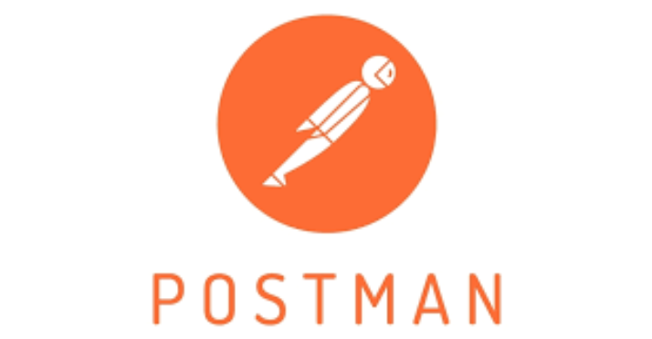

# Гайд по Postman: Основы и Практическое Применение  

---
 

## **Введение в Postman**  
Postman — это мощный инструмент для работы с API, который позволяет отправлять HTTP-запросы, тестировать, документировать и автоматизировать взаимодействие с веб-сервисами. Он особенно полезен для:  
- Разработчиков API  
- Тестировщиков  
- Инженеров по автоматизации  
- Аналитиков  

**Postman помогает:**  
- Отправлять GET, POST, PUT, DELETE и другие HTTP-запросы.  
- Сохранять и организовывать коллекции запросов.  
- Автоматизировать тестирование API.  
- Генерировать документацию.  
- Работать с переменными и окружениями.  
- Мокать API (создавать mock-серверы).  

---

## **1. Установка Postman**  
### **Шаг 1: Скачивание**  
Перейдите на [официальный сайт Postman](https://www.postman.com/downloads/) и выберите версию для вашей ОС:  
- Windows  
- macOS  
- Linux  

### **Шаг 2: Установка**  
Запустите установщик и следуйте инструкциям.  

### **Шаг 3: Регистрация (опционально)**  
Postman можно использовать без аккаунта, но для синхронизации коллекций между устройствами рекомендуется создать учетную запись.  

---

## **2. Основные функции Postman**  
### **2.1. Отправка HTTP-запросов**  
1. Откройте Postman.  
2. Нажмите **New Request** (или `+` на вкладке).  
3. Выберите метод (GET, POST и т. д.).  
4. Введите URL (например, `https://api.example.com/users`).  
5. Нажмите **Send**.  

### **2.2. Просмотр ответа**  
После отправки запроса вы увидите:  
- **Status Code** (200, 404 и др.).  
- **Body** (JSON, XML, HTML и т. д.).  
- **Headers** (метаданные ответа).  
- **Cookies** (если есть).  

### **2.3. Работа с параметрами и заголовками**  
- **Query Parameters** (для GET-запросов):  
  ```
  https://api.example.com/users?page=1&limit=10
  ```
- **Headers** (например, `Authorization: Bearer token`).  
- **Body** (для POST/PUT):  
  - **raw** (JSON, XML, текст).  
  - **form-data** (для загрузки файлов).  
  - **x-www-form-urlencoded** (стандартные формы).  

---

## **3. Работа с коллекциями**  
Коллекции помогают организовывать запросы.  

### **3.1. Создание коллекции**  
1. Нажмите **New → Collection**.  
2. Укажите название и описание.  
3. Добавьте запросы (перетащите или создайте внутри коллекции).  

### **3.2. Экспорт и импорт коллекций**  
- **Экспорт:**  
  - Кликните на `...` у коллекции → **Export**.  
  - Выберите формат (JSON).  
- **Импорт:**  
  - Нажмите **Import** → загрузите файл.  

### **3.3. Документирование API**  
- В коллекции можно добавлять описания.  
- Используйте **Publish Docs** для генерации публичной документации.  

---

## **4. Переменные и окружения**  
### **4.1. Глобальные и локальные переменные**  
- **Глобальные:** Доступны во всех запросах.  
- **Локальные:** Только в текущем окружении.  

Пример:  
```
{{base_url}}/users  → https://api.example.com/users
```
### **4.2. Создание окружения**  
1. Нажмите **Environments → New**.  
2. Добавьте переменные (например, `base_url = https://api.example.com`).  
3. Выберите окружение в выпадающем списке.  

---

## **5. Автоматизация тестирования**  
### **5.1. Написание тестов на JavaScript**  
В Postman можно добавлять скрипты в **Tests**:  
```javascript
pm.test("Status code is 200", function () {
    pm.response.to.have.status(200);
});

pm.test("Response has data", function () {
    var jsonData = pm.response.json();
    pm.expect(jsonData.users).to.be.an('array');
});
```
### **5.2. Запуск коллекции через Runner**  
1. Откройте **Collection Runner**.  
2. Выберите коллекцию и окружение.  
3. Нажмите **Run**.  

---

## **6. Mock-серверы**  
Позволяют имитировать API без реального бэкенда.  

### **6.1. Создание Mock-сервера**  
1. Кликните **New → Mock Server**.  
2. Выберите коллекцию или создайте примеры запросов.  
3. Укажите URL мока (например, `https://your-mock-id.mock.pstmn.io`).  

### **6.2. Использование**  
Отправляйте запросы на mock-URL, Postman вернет заранее заданные ответы.  

---

## **7. Советы по использованию**  
- **Группировка запросов:** Используйте папки в коллекциях.  
- **Pre-request Scripts:** Автоматическая настройка запросов перед отправкой.  
- **Интеграция с CI/CD:** Запуск тестов через Newman (CLI-версия Postman).  
- **Экспорт в cURL:** Кликните **Code** → копируйте cURL-команду.  

---

## **Заключение**  
Postman — это незаменимый инструмент для работы с API. Начните с простых запросов, освойте коллекции и автоматизацию, затем переходите к mock-серверам и интеграции с CI/CD.  

🚀 **Готовы к работе? Вперед к освоению Postman!**  

Если есть вопросы — спрашивайте в комментариях!