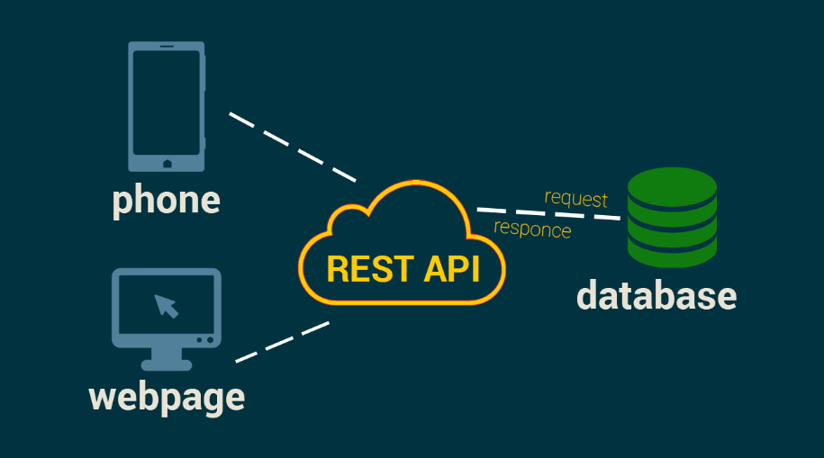

# Гайд по REST API  

  

REST API (Representational State Transfer) — это архитектурный стиль для создания веб-сервисов, использующий стандартные HTTP-методы (GET, POST, PUT, DELETE и др.) для взаимодействия между клиентом и сервером. REST основан на принципах простоты, масштабируемости и независимости от платформы, что делает его одним из самых популярных подходов к разработке API.  

Если вам нужно создать или использовать веб-сервис, который легко интегрируется с различными клиентами (веб, мобильные приложения, IoT), REST API — отличный выбор.  

---

## 1. **Основные концепции REST API**  

Перед началом работы важно понять ключевые принципы REST:  

- **Ресурсы (Resources)** – Все данные представлены в виде ресурсов, доступных по уникальным URL (например, `/users`, `/posts`).  
- **HTTP-методы** – Определяют действие над ресурсом:  
  - `GET` – получение данных.  
  - `POST` – создание нового ресурса.  
  - `PUT/PATCH` – обновление ресурса.  
  - `DELETE` – удаление ресурса.  
- **Статус-коды HTTP** – Показывают результат запроса:  
  - `200 OK` – успешный запрос.  
  - `201 Created` – ресурс создан.  
  - `400 Bad Request` – ошибка клиента.  
  - `404 Not Found` – ресурс не найден.  
  - `500 Internal Server Error` – ошибка сервера.  
- **Формат данных** – Обычно JSON или XML (JSON более популярен).  
- **Stateless (без состояния)** – Сервер не хранит состояние клиента между запросами.  

---

## 2. **Создание простого REST API**  

Рассмотрим пример REST API на Python с использованием Flask.  

### **Установка Flask**  
```bash
pip install flask
```

### **Пример сервера (`server.py`)**  
```python
from flask import Flask, request, jsonify

app = Flask(__name__)

# Пример базы данных (в реальном проекте используйте SQLite/PostgreSQL)
users = [
    {"id": 1, "name": "Alice"},
    {"id": 2, "name": "Bob"}
]

# Получить всех пользователей (GET)
@app.route('/users', methods=['GET'])
def get_users():
    return jsonify(users)

# Получить пользователя по ID (GET)
@app.route('/users/<int:user_id>', methods=['GET'])
def get_user(user_id):
    user = next((u for u in users if u['id'] == user_id), None)
    if user:
        return jsonify(user)
    return jsonify({"error": "User not found"}), 404

# Создать пользователя (POST)
@app.route('/users', methods=['POST'])
def create_user():
    new_user = request.json
    users.append(new_user)
    return jsonify(new_user), 201

# Обновить пользователя (PUT)
@app.route('/users/<int:user_id>', methods=['PUT'])
def update_user(user_id):
    user = next((u for u in users if u['id'] == user_id), None)
    if not user:
        return jsonify({"error": "User not found"}), 404
    data = request.json
    user.update(data)
    return jsonify(user)

# Удалить пользователя (DELETE)
@app.route('/users/<int:user_id>', methods=['DELETE'])
def delete_user(user_id):
    global users
    users = [u for u in users if u['id'] != user_id]
    return jsonify({"message": "User deleted"}), 200

if __name__ == '__main__':
    app.run(debug=True)
```

### **Пример клиентского запроса (cURL)**  
```bash
# Получить всех пользователей
curl http://localhost:5000/users

# Создать нового пользователя
curl -X POST -H "Content-Type: application/json" -d '{"id": 3, "name": "Charlie"}' http://localhost:5000/users

# Обновить пользователя
curl -X PUT -H "Content-Type: application/json" -d '{"name": "Bobby"}' http://localhost:5000/users/2

# Удалить пользователя
curl -X DELETE http://localhost:5000/users/3
```

---

## 3. **Документирование API**  

Хорошая документация важна для разработчиков, использующих ваш API. Популярные инструменты:  

- **Swagger/OpenAPI** – Стандарт для описания REST API.  
- **Postman** – Позволяет тестировать и документировать API.  

Пример OpenAPI (Swagger) для нашего API:  
```yaml
openapi: 3.0.0
info:
  title: User API
  version: 1.0.0
paths:
  /users:
    get:
      summary: Get all users
      responses:
        '200':
          description: A list of users
    post:
      summary: Create a user
      requestBody:
        required: true
        content:
          application/json:
            schema:
              type: object
              properties:
                id:
                  type: integer
                name:
                  type: string
      responses:
        '201':
          description: User created
```

---

## 4. **Аутентификация и безопасность**  

REST API должен быть защищен:  

- **JWT (JSON Web Tokens)** – Популярный метод аутентификации.  
- **OAuth 2.0** – Для авторизации через сторонние сервисы.  
- **HTTPS** – Всегда используйте шифрование трафика.  

Пример JWT в Flask:  
```python
from flask_jwt_extended import JWTManager, create_access_token, jwt_required

app.config['JWT_SECRET_KEY'] = 'super-secret-key'
jwt = JWTManager(app)

@app.route('/login', methods=['POST'])
def login():
    username = request.json.get('username')
    password = request.json.get('password')
    if username == 'admin' and password == '123':
        token = create_access_token(identity=username)
        return jsonify(access_token=token)
    return jsonify({"error": "Invalid credentials"}), 401

@app.route('/protected', methods=['GET'])
@jwt_required()
def protected():
    return jsonify(message="This is a protected route!")
```

---

## 5. **Оптимизация и лучшие практики**  

- **Кэширование** – Используйте `Cache-Control` и `ETag` для ускорения запросов.  
- **Пагинация** – Разбивайте большие списки (`/users?page=1&limit=10`).  
- **Валидация данных** – Проверяйте входные данные (например, с помощью Pydantic).  
- **Логирование** – Записывайте ошибки и запросы (Logstash, ELK-стек).  
- **Rate Limiting** – Ограничивайте частоту запросов для защиты от DDoS.  

---

## **Заключение**  

REST API — это гибкий и удобный способ создания веб-сервисов. Начав с простых запросов, вы можете масштабировать API до сложных систем с аутентификацией, документацией и оптимизацией.  

Готовы начать? Попробуйте создать свой первый REST API! 🚀  

---  

Этот гайд поможет вам разобраться в основах REST API и применить их на практике. Удачи в разработке!