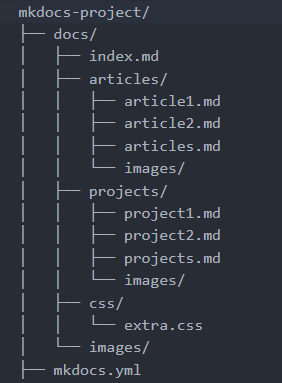

# 
Добро пожаловать на мой сайт!

<link rel="stylesheet" href="https://cdnjs.cloudflare.com/ajax/libs/animate.css/4.1.1/animate.min.css">
---

Меня зовут Вадим, и я специалист в области разработки и тестирования программного обеспечения. Моя цель — создавать качественные и надежные решения, оптимизируя процессы разработки и тестирования с помощью современных инструментов и методов.

---

## Что вас ждёт на этом сайте?

- **Статьи**: Гайды про разработку и автоматизацию. 
- **Проекты**: Мои небольшие приложения, игры, скрипты.
- **Интересные темы**: От теории до практики — всё, что связано с IT.
- **Мемы**: Юмор про IT и не только.

---

## Структура проекта v1.0

_mkdocs, js, python_

---

## Мой топ команд:

Я их постоянно забываю:

- `python -m venv venv` — Создание виртуальной среды.
- `venv\Scripts\activate` — Активировать виртуальную среду.
- `pip freeze > requirements.txt` — список всех установленных пакетов и их версий.
- `mkdocs`, `readthedocs`, `cerulean`, `cosmo`, `cyborg`, `darkly`, `flatly`, `journal`, `litera`, `lumen`, `lux`, `materia`, `minty`, `pulse`, `sandstone`, `simplex`, `slate`, `solar`, `spacelab`, `superhero`, `united`, `yeti`, `material` — mkdocs темы  

---

## Music & Ambience!

---

## Обратная связь

_Если у вас есть вопросы или предложения, напишите мне на почту: [seevaa57@gmail.com](mailto:email@example.com)_

---

  ❤️
  

    v2.7

