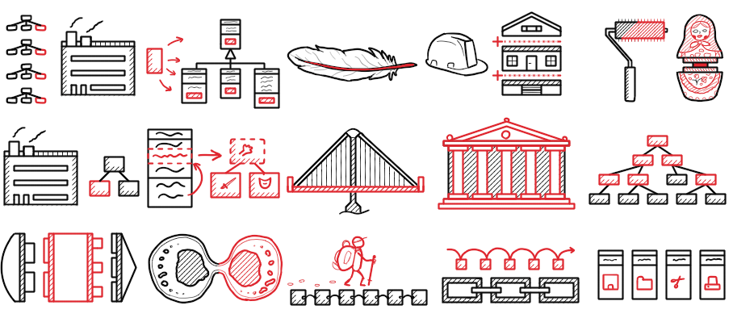

# 
Паттерны🧩

<link rel="stylesheet" href="https://cdnjs.cloudflare.com/ajax/libs/animate.css/4.1.1/animate.min.css">

## **Что такое паттерны проектирования?**  
Паттерны программирования (или шаблоны проектирования) — это проверенные решения типовых задач, возникающих при разработке ПО. Они помогают создавать гибкий, понятный и поддерживаемый код.  

## **Зачем использовать паттерны?**  
✅ **Улучшение структуры кода** – делают его более организованным и читаемым.  
✅ **Повторное использование решений** – избавляют от изобретения велосипедов.  
✅ **Упрощение коммуникации** – дают разработчикам общий язык.  
✅ **Гибкость и расширяемость** – позволяют легче адаптировать систему под изменения.  

---

## **Основные категории паттернов**  

### **1. Порождающие (Creational Patterns)**  
Отвечают за создание объектов, делая процесс гибким и управляемым.  

- [Singleton](singleton.md) – гарантирует, что у класса есть только один экземпляр.  
- **Factory Method** – определяет интерфейс для создания объектов, делегируя выбор подклассам.  
- **Abstract Factory** – создает семейства связанных объектов без указания их конкретных классов.  
- **Builder** – разделяет конструирование сложного объекта и его представление.  
- **Prototype** – копирует существующие объекты вместо создания новых.  

### **2. Структурные (Structural Patterns)**  
Помогают строить гибкие и эффективные структуры классов и объектов.  

- **Adapter** – позволяет несовместимым интерфейсам работать вместе.  
- **Decorator** – добавляет объектам новые функции динамически.  
- [Facade](facade.md) – упрощает работу со сложной подсистемой через единый интерфейс.  
- [Proxy](proxy.md) – контролирует доступ к объекту (например, ленивая загрузка).  
- [Page Object](pageobject.md) (особенно в тестировании) – абстрагирует веб-страницы в объекты.  

### **3. Поведенческие (Behavioral Patterns)**  
Решают задачи взаимодействия между объектами.  

- **Observer** – уведомляет зависимые объекты об изменениях (например, события UI).  
- **Strategy** – инкапсулирует алгоритмы, делая их взаимозаменяемыми.  
- **Command** – превращает запросы в объекты, поддерживая отмену операций.  
- **State** – меняет поведение объекта в зависимости от его состояния.  
- **Chain of Responsibility** – передает запрос по цепочке обработчиков.  

---

## [**Паттерн "Четверки" (Gang of Four, GoF)**](gof_patterns.html) 
Термин относится к книге *"Design Patterns: Elements of Reusable Object-Oriented Software"* (1994), написанной четырьмя авторами:  
- Эрих Гамма (Erich Gamma)  
- Ричард Хелм (Richard Helm)  
- Ральф Джонсон (Ralph Johnson)  
- Джон Влиссидес (John Vlissides)  

Именно они систематизировали 23 классических паттерна, которые стали стандартом в ООП.  

**Примеры из реального мира:**  
- **Singleton** → Логгеры, подключения к БД.  
- **Observer** → Реактивные системы (например, RxJS).  
- **Decorator** → Декораторы в Python (`@decorator`).  

--- 

Не используй паттерны "насильно" – применяйте их там, где они действительно решают проблему!

