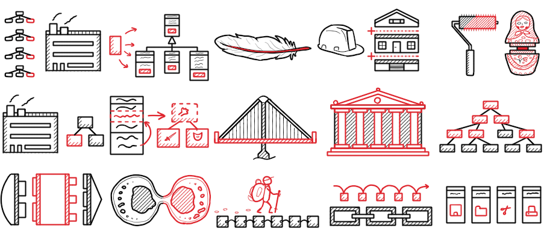

# 
Паттерны🧩

<link rel="stylesheet" href="https://cdnjs.cloudflare.com/ajax/libs/animate.css/4.1.1/animate.min.css">

<!-- 2. Постепенное появление (элегантный вход)
<h1 class="animate__animated animate__fadeInDown">Паттерны 🔧</h1> -->

Паттерны программирования, также известные как шаблоны проектирования (design patterns), представляют собой типовые решения повторяющихся задач, которые встречаются в процессе разработки программного обеспечения. Они помогают разработчикам создавать более гибкие, понятные и легко поддерживаемые системы.

### Зачем используются паттерны:

1. **Улучшение структуры кода**: Паттерны помогают организовать код, делая его более структурированным и понятным.
2. **Повторное использование решений**: Они предоставляют проверенные временем решения, которые можно использовать повторно в различных проектах.
3. **Упрощение коммуникации**: Использование паттернов упрощает общение между разработчиками, так как они представляют собой общепринятые термины и концепции.
4. **Повышение гибкости и расширяемости**: Паттерны помогают создавать системы, которые легче адаптировать и расширять.

### Основные категории паттернов:

1. **Порождающие паттерны (Creational Patterns)**:
   - [Singleton](articles/article22.md): Обеспечивает создание только одного экземпляра класса.
   - **Factory Method**: Определяет интерфейс для создания объектов, позволяя подклассам изменять тип создаваемых объектов.
   - **Abstract Factory**: Предоставляет интерфейс для создания семейств взаимосвязанных объектов без указания их конкретных классов.
   - **Builder**: Разделяет конструкцию сложного объекта от его представления, позволяя создавать объект поэтапно.
   - **Prototype**: Создает новые объекты путем клонирования уже существующих.

2. **Структурные паттерны (Structural Patterns)**:
   - **Adapter**: Позволяет объектам с несовместимыми интерфейсами работать вместе.
   - **Decorator**: Динамически добавляет объектам новые обязанности.
   - **Facade**: Предоставляет упрощенный интерфейс к сложной подсистеме.
   - **Proxy**: Контролирует доступ к другому объекту, выступая в роли заместителя.
   - [Page Object](page_object_pattern.md): создает абстракцию над веб-страницами, превращая их в удобные программные объекты.

3. **Поведенческие паттерны (Behavioral Patterns)**:
   - **Observer**: Определяет зависимость "один ко многим" между объектами, так что изменение состояния одного объекта приводит к автоматическому обновлению всех зависящих от него объектов.
   - **Strategy**: Определяет семейство алгоритмов, инкапсулирует каждый из них и делает их взаимозаменяемыми.
   - **Command**: Преобразует запросы в объекты, позволяя передавать их как аргументы, сохранять в истории и поддерживать отмену.
   - **State**: Позволяет объекту изменять свое поведение в зависимости от его состояния.
   - **Chain of Responsibility**: Передает запросы последовательно по цепочке обработчиков до тех пор, пока один из них не обработает запрос.

Паттерны проектирования помогают разработчикам решать типичные задачи, используя проверенные подходы, что способствует созданию более качественного и поддерживаемого кода.

