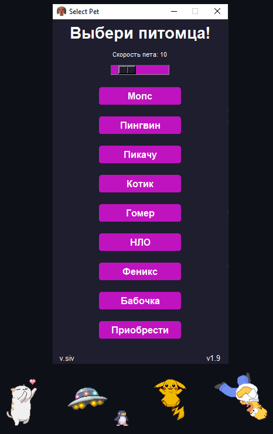

# Проект 1: "Pet-Desktop-Ver-2-0"

## Описание

приложение, которое позволяет пользователям выбирать и наблюдать за виртуальными питомцами, двигающимися по экрану. Питомцы могут быть различными анимированными персонажами, такими как "Мопс", "Пикачу", "Пингвин", "Котик" и другие. Приложение предназначено для развлечения и добавления элемента веселья в повседневную работу за компьютером.

## Функционал

- Выбор питомца: Пользователи могут выбрать питомца из списка доступных персонажей.
- Настройка скорости: Пользователи могут регулировать скорость движения питомца.
- Интерактивность: Питомцы реагируют на действия пользователя, такие как наведение курсора и нажатие клавиш.
- Поведение питомцев: Некоторые питомцы имеют уникальное поведение.

## Технологии

- Язык программирования: Python
- Библиотека: Tkinter

## Ссылки

- [Исходный код на GitHub](https://github.com/Showtimeeee/Pet-Desktop-Ver-2-0)

---

*Оставьте отзыв, если вам понравилась программа!*