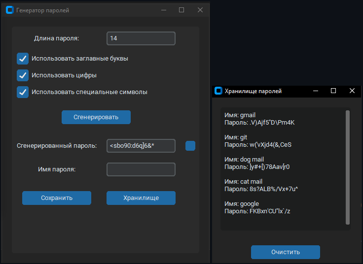

# Pass-Bro-Generator

## Описание

Генератор паролей с графическим интерфейсом, предлагающий безопасное хранение в формате JSON для простого управления и извлечения

## Функционал

- Генерация паролей, разной сложности.
- Сохранение в хранилище.

## Технологии

- Язык программирования: Python
- Библиотеки: customtkinter, tkinter, json

## Ссылки

- [Исходный код на GitHub](https://github.com/Showtimeeee/Pass-Bro-Generator)
- [Скачать EXE-файл](https://drive.google.com/drive/folders/1wngep32aqvGb6lf1w8kwi6pA66cKoJjc)
---

*Если нужна помощь с настройкой, свяжитесь со мной!*

