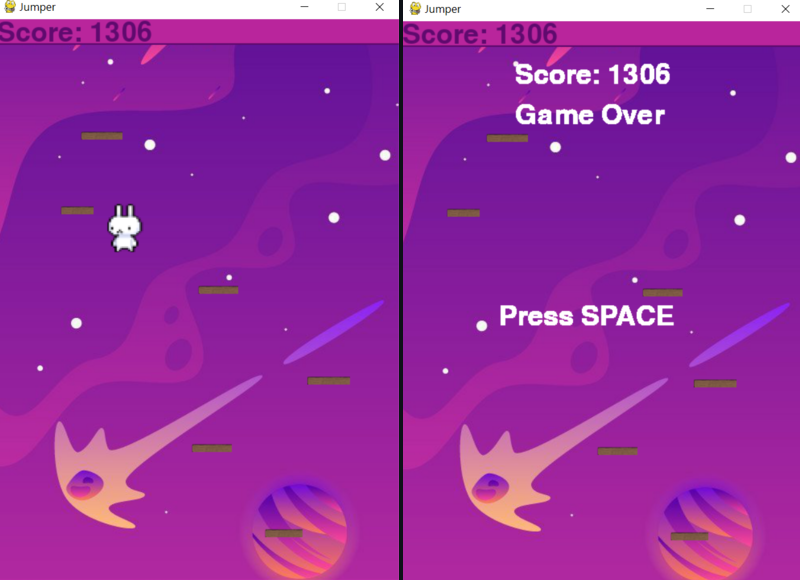

# Jumper-Pygame

## Описание

Простой платформер на Pygame с бесконечной прокруткой. Прыгайте, избегайте препятствий и соберите как можно больше очков! Игра сохраняет ваш лучший результат, чтобы вы могли побить его снова и снова.

## Функционал

- Бесконечная прокрутка уровня.
- Управление персонажем.
- Случайная генерация препятствий.
- Подсчет, сохранение очков.

## Технологии

- Язык программирования: Python
- Библиотека: Pygame

## Ссылки

- [Исходный код на GitHub](https://github.com/Showtimeeee/Pet-Desktop-Ver-2-0)
- [Скачать EXE-файл](https://drive.google.com/drive/folders/1liVAmQv0wetmFW7pG-Z1HL9viNGFZl3S)
---

*Оставьте отзыв, если вам понравилась программа!*
