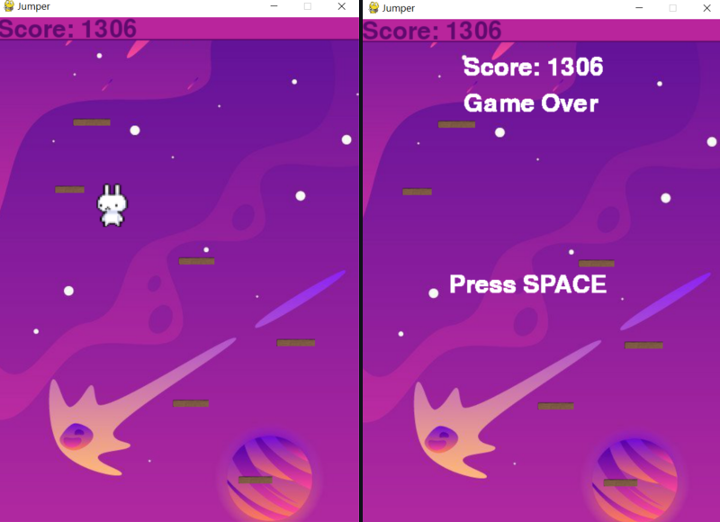

# Jumper-Pygame 🐇

Простой платформер на Pygame с бесконечной прокруткой. Прыгайте, избегайте препятствий и соберите как можно больше очков! Игра сохраняет ваш лучший результат, чтобы вы могли побить его снова и снова.

- Бесконечная прокрутка уровня.
- Управление персонажем.
- Случайная генерация препятствий.
- Подсчет, сохранение очков.

---

- [Исходный код на GitHub](https://github.com/Showtimeeee/Pygame-Engine-Top-Games/tree/main/Jumper-Pygame-master)
- [Скачать EXE-файл](https://drive.google.com/drive/folders/1liVAmQv0wetmFW7pG-Z1HL9viNGFZl3S)
