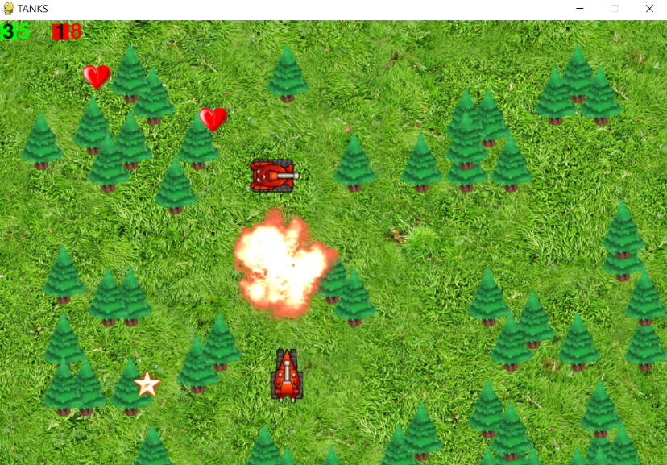

# "Tanks_p_vs_p_pygame"

## Описание

Ремейк танчиков — это захватывающая игра, вдохновленная классическими танчиками, которая переносит вас в мир динамичных сражений и тактических манёвров

## Функционал

- Прокачка: Улучшайте свой танк.
- Каждый бой уникален благодаря случайно генерируемым препятствиям.
- Разрушение препятсвий
## Технологии

- Язык программирования: Python
- Библиотека: Pygame

## Ссылки

- [Исходный код на GitHub](https://github.com/Showtimeeee/Tanks_p_vs_p_pygame)

*Оставьте отзыв, если вам понравилась игра!*

