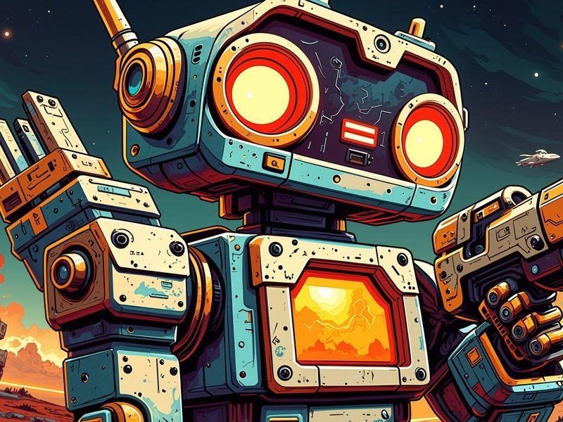

# 
Проекты🤖

<link rel="stylesheet" href="https://cdnjs.cloudflare.com/ajax/libs/animate.css/4.1.1/animate.min.css">

Здесь представлены мои пет-проекты, программы и инструменты, которые я создал. Нажмите на название проекта, чтобы узнать больше!

---

#### - [Десктоп приложение "Pet-Desktop-Ver-2-0"](project1.md)
#### - [Генератор паролей "Pass-Bro-Generator"](project2.md)
#### - [Игра-платформер "Jumper-Pygame"](project3.md)
#### - [Игра-платформер "Tanks_p_vs_p_pygame"](project4.md)

---

#### - [Муравьиная Колония (Ants-Bro)🐜](ant_colony/ants.html)
#### - [ДНК (DNA-Bro)🧬](..//graphs/dna/dna.html)
#### - [Хакер-мод (Terminal-Bro)💻](../hacking/hacking.md)
#### - [Переключатели (Control-Lab-Bro)🕹️](switches/switches_sliders.html)

---

*Если у вас есть вопросы или предложения, напишите мне!*
