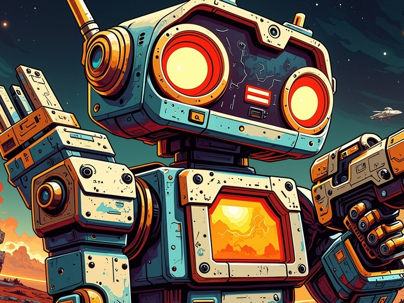

# 
Проекты🤖

<link rel="stylesheet" href="https://cdnjs.cloudflare.com/ajax/libs/animate.css/4.1.1/animate.min.css">

Здесь представлены мои пет-проекты, программы и инструменты, которые я создал. Нажмите на название проекта, чтобы узнать больше!

---

#### - [Десктоп приложение "Pet-Desktop-Ver-2-0"](project1.md)
#### - [Генератор паролей "Pass-Bro-Generator"](project2.md)
#### - [АФК-Бот "AFK-APP-L"](afk_bot_app.md)
#### - [Pygame-платформеры](pygame_platform_games.md)

---

#### - [Магия Таверны🐉](taverna_mana/taverna_mana.html)
#### - [Муравьиная Колония (Ants-Bro)🐜](ant_colony/ants.html)

---

#### - [Сжать изображение (Compress-Image-Сonverter-Bro)🗜️](images_mod/image_compress_convert.html)
#### - [Генератор Данных (Generator-Bro-Data)🎰](project6.md)

---

#### - [Bro-Radio 📻](https://bro-radio.onrender.com/)
#### - [Bro-Roulette 🎡](https://bro-roulette.onrender.com/)

---

*Если у вас есть вопросы или предложения, напишите мне!*
